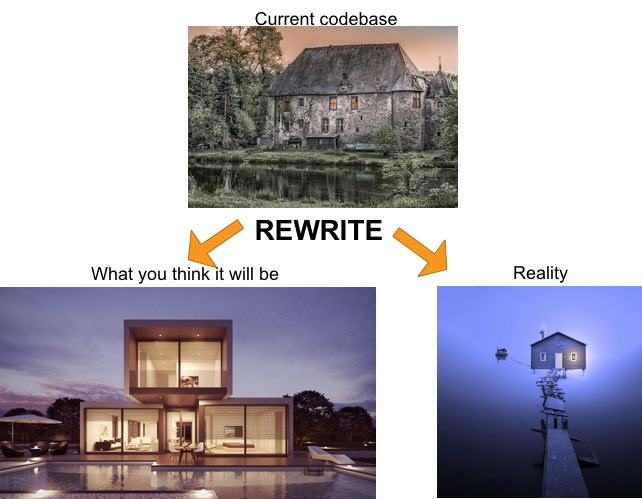

I recently gave a talk at the Fourth Conference of Research Software Engineering (RSEConUK 2019) regarding options when dealing with legacy software. It aimed to answer the question of whether to rewrite or refactor a legacy code base when the code reaches breaking point. I added a third option as well, retiring software, which I think covers the alternative view of letting software just die. Hence the title - Refactor, Rewrite, or Retire? This was motivated strongly by anecdotal viewpoints but I also feel it represents viewpoints of the wider developer community, with some notable references. I will translate the main points of the talk into the medium of a blog entry.

So to Refactor, Rewrite, or Retire? 

    <b>TLDR:</b> <big>Refactor!</big>*

    <small>* almost always</small>

The short answer is just that, and is my general conclusion. Earlier in my career my answer was different, always rewrite, but I have realised that over time rewriting is usually not the best solution. However, those who are eagled-eyed will have noticed the  asterisk next to refactor - it is not always the case, there are exceptions. Now let me motivate you as to why.

A brief introduction to my experience and background to help motivate my case. I started my career as a physicist during my PhD, and since migrated through various different industries and domains: research, private sector, start-ups, and now Government. Spanning Physics research, Petrochemical industry, IT security, to the Nuclear industry. Across this portfolio of industries I have spent a large amount of my career dealing with legacy and inherited code bases (mainly Fortran), and I have done all three! Though I would say that around 80% has been refactoring code bases, so I am slightly biased, even though my personal favourite is to rewrite. Some of the rewrites I have done have been successful and fun to design and build, but others have not been so successful, and still to this day people/managers/users/stakeholders have reverted to the original code base and ignored the rewrite at a significant financial cost. It always came down to the fact that results had changed or if not, the interface was too dramatic a change, and it was not adopted. One particular project from my junior days, in which I pushed for a rewrite, remains one of my largest regrets (in software, not in life).

Let's start with some common complaints (from developers) of legacy code bases, to help motivate my case. Some of which you may hear being shouted down the corridor. 

<i>"There are no tests"</i> 

<i>"Why did they use Cobol?"</i> 

<i>"This code is so slow!"</i> 

<i>"This code is a mess"</i> 

<i>"The last developer was useless"</i> 

And so forth... OK, not all are common, but the main one I would like to highlight, and feel particularly defines legacy 
code - lack of tests. 

So why do developers have such complaints? Well I have defined some 'laws' of programming, or should I say more anecdotal views.

<ol style="margin-left:50px;margin-right:50px">
  <li><b>The law of Asymmetry: </b>Writing code is much easier than reading code</li>
  <li><b>The law of Time: </b>Code does not age well</li>
  <li><b>The law of Naivety: </b>The next developer will always think they are better than the last</li>
</ol>

Law 1 is very appropriate to me. I am sure that most developers like to write code more than read it, and therefore many find it easier to write code. I find it is a valuable skill for a developer to be able to not only write good readable code, but to be able to read someone else's code. I think this is because generally there is more than one way to solve a problem, and if it wasn't solved your way then humans can find that frustrating.

Law 2 is quite obviously true - plain and simple. If we look at how much things have changed just in the past 10 years, and the rise and fall of new technologies and programming languages, this one is very obvious. And this is only accelerating. Legacy code doesn't have to be 40 years old.

Law 3 is maybe not applicable to all developers, but a large amount I have worked with always think they are better than their predecessors without knowing anything about them, but based on a few glimpses of their inherited code. I know I have fallen for this a few times. I have even done this to my own code not knowing it was me who initially wrote it!

With those laws now clearly defined we can move onto the great question.

    <strong><big><i>"Why don't we just rewrite it?"</i></big></strong>

It is usually raised by a developer, or team of developers, who simply cannot work with the code anymore, and to add one simple feature, causes a whole backlog of problems and performance issues. "Why don't we just rewrite it?". It is rare for project managers to ask this, but it does happen. However, as my title suggests, this is not always the best solution, even if developers are frustrated. Refactoring is never glamorous but much, much safer, and retiring software is never exciting, but sometimes necessary.

I am now going to try and create a nice analogy with regard to building or renovating a house. Hopefully it won't break down. 

Let's propose you have an existing code base (the lovely old house at the top) which after the years needs some work and looks 
a bit rundown, it's got lot's of structural problems but it matches the users requirements. That is until a stakeholder (in this case the property owner) wants to have a party and complains that you cannot have the lights on in every room all the time (let's say only you can only ever have at most 50% of the lights on simultaneously) silly I know but it was in the original requirements. Now it is too much work to pull apart all the electrics in the house and rewire everything, it simply will take too long and be far too costly. What would be better is to smash it down and rebuild it from scratch. But of course according to the laws it does not turn out as you planned (lower left), instead you end up with the lower right. The lights all work but there are now only 2, because you didn't have time to put more in. The swimming pool you planned is now an overwhelming sea that is too hard to maintain, and the bridge over it to the house would not survive a small storm (bugs). 

OK, I think I may have taken that far enough, but what does it mean to rewrite software?

    <strong><big><i>
    "If all the parts of a ship are replaced over time, is the new ship still the same as the original ship?" 
    </i></big></strong>
    - Ship of Theseus

I am going to use this philosophical question to try to define what I mean. 
Finding a strict definition of a rewrite or a refactor in literature or online is difficult, and trying to pin it down is not as clear as I initially thought. This is my attempt. 

<ol style="margin-left:50px;margin-right:50px">
  <ul><b>Rewrite</b>
    <ol style="margin-left:50px;margin-right:50px">
        <ul>Written an entirely <b>new code</b> from scratch, based on first principles</ul>
        <ul>Behaviour and interface can be changed/unchanged</ul>
        <ul>Major new release or new product</ul>
    </ol>
  </ul>
  <ul><b>Refactor</b>
    <ol style="margin-left:50px;margin-right:50px">
        <ul>Existing code is reused, restructured, wrapped i.e refactored</ul>
        <ul>Behaviour and interface <b>unchanged</b></ul>
        <ul>Major or minor new release, same product</ul>
    </ol>
  </ul>
  <ul><b>Retire</b>
    <ol style="margin-left:50px;margin-right:50px">
        <ul>End of life</ul>
        <ul>No longer supported</ul>
        <ul>No future bug fixes or releases</ul>
    </ol>
  </ul>
</ol>

A rewrite can represent a behaviour or an interface change, but not always the case, it can be functionally the same in ever manner but completely different under the hood. This is the crucial part, it is an entirely different code base, written from scratch, or almost. It should be taken from first principles, theory, requirements, etc, but use little or minimal of the existing code base. Usually a programming language but again not always the case. Now a refactor is a bit more strict in terms of interface and behaviour change. Indeed you can add new APIs, or change a few, but on the whole most interfaces will be preserved or wrapped. Fundamentally it is the same code base, over time this could become completely different from the original but is incrementally similar. Retiring software is a bit more straightforward in terms of definition, but in no way simple to implement. It represents an end of life product, no future bug fixes, updates, no longer supported, i.e python 2.7 in a few months time. 

<b>Arguments for rewrite</b>

Let's start with arguments for a rewrite. Firstly, because of money - developers are costly and so is their recruitment. Say for example, we have an existing code base written in ADA, and you need senior developers in this language and they need to relocate to Cirencester, recruitment might be tricky. Similarly getting such niche developers can be costly, due to effects of supply and demand. In these cases it may be (caution with the words may be) better to rewrite in another more popular language. Again, coming back to money, in the case of strongly coupled systems it can be too time consuming to make a change and better to start again.

<b>Arguments for refactor</b>

On the other hand, with refactor we can use similar arguments against a rewrite. A lot of effort has gone into the existing code base, and therefore a lot of money has gone into it. Can you really rewrite it all for a lower cost than refactoring? The next big argument is one that has been used by Joel Spolsky (co-founder of stack overflow), the amount of bugs that have been fixed in that code base, do you think you can do that in a rewrite? See his views [here](https://www.joelonsoftware.com/2000/04/06/things-you-should-never-do-part-i/). My strongest argument for a refactor, which especially applies to software used in critical systems, is minimal risk. Refactoring can be very modular and incremental, keeping stakeholders happy and ensuring results do not change. People do not like change! As I said at the start - the default and recommended solution.

<b>Arguments for retiring</b>

Nothing lasts forever! Retiring software usually occurs when clients no longer use it, and has been superseded by another product. Even though it may have been superseeded some clients will refuse to abandon it, for reasons due to cost or, as mentioned on the previously, due to risk of changes. This should always remain an option as nothing lasts forever. A great talk on how to retire software, or services, can be found from last years conference by Catherine Jones [here](https://drive.google.com/file/d/1qe7urSXo6AFiuSsn-I--0ObTFomxaA-Z/).

<h3>The Good, the Bad and the Ugly</h3>
Now to provide some examples of the good, the bad and the ugly in terms of rewrites.

Let's start with the ugly.

<h4>Netscape</h4>

Netscape, probably the most famous rewrite failure. Netscape was the dominant web browser in the early 90's but is almost non existent today. They decided to rewrite their whole code base, apparently due to a horrible code base and performance reasons, but it took over two years to complete, and it didn't go well from there. Largely considered a failure and possibly responsible for their downfall. Although it is not fair to entirely blame the lack of dominance due to the rewrite, IE came about soon after, and we all know the rest of that story.

<h4>Microsoft Word</h4>
The bad.

Microsoft Word decided to rewrite their code base in order to unify codes for both mac OS and Windows - codename Project Pyramid. Started in early 90's again, but unlike Netscape they did this in parallel with development of the existing code. This meant that whilst they could never catch up, the repercussions were not as detrimental as with Netscape. They could still deliver products based on the existing code base. It did cost them financially though.

<h4>Geant</h4>
The good.

Much less well known than the previous two, it is only used within scientific communities, with a heavy research focus. Geant is a scientific Monte Carlo particle transport code developed by CERN, and it is used in applications for particle, nuclear, and medical physics. Geant 4 (C++) is the current version and was a complete rewrite from Geant 3 (Fortran), originating from the 70's. Whilst some experiments still use Geant 3 (some people still don't trust Geant 4), it is hailed generally as a success by many and is massively popular in those communities. There is of course another rewrite planned and development ongoing, Geant-V, which then attempts to address existing performance issues (it can be quite slow). The V is for vectorised, not 5. 
More on Geant [here](http://geant.cern.ch/)

<h3>Final thoughts</h3>

<ul style="margin-left:50px;margin-right:50px">
  <li><b>Don't let programming language bias drive for a rewrite</b></li>
  <li><b>Resist initial temptation for a rewrite</b></li>
  <ul style="margin-left:50px;margin-right:50px">
    <li>Code does not rust</li>
    <li>Ugly code can be very reliable</li>
  </ul>
  <li><b>Testing is crucial for refactor or rewrite</b></li>
  <ul style="margin-left:50px;margin-right:50px">
    <li>System and regression tests are essential before you rewrite or refactor</li>
  </ul>
  <li><b>Refactoring is always less risky</b></li>
  <ul style="margin-left:50px;margin-right:50px">
    <li>People don't like change</li>
  </ul>
  <li><b>Remember the laws!</b></li>
</ul>

However, sometimes a rewrite is unavoidable, and can (sometimes) pay off in the long run. A colleague of mine once suggested that all code should have an expiry date, and therefore proposes that all software should be rewritten every N years. Whilst a radical opinion and completely against what I preach, there are interesting arguments for this, which I will not go into right now. Maybe for a later blog post.

Remember that most nuclear reactors running today are based on old Fortran code and data originating from the 1960's. 

<strong><b>
If it ain't broke don't fix it.
</b></strong>