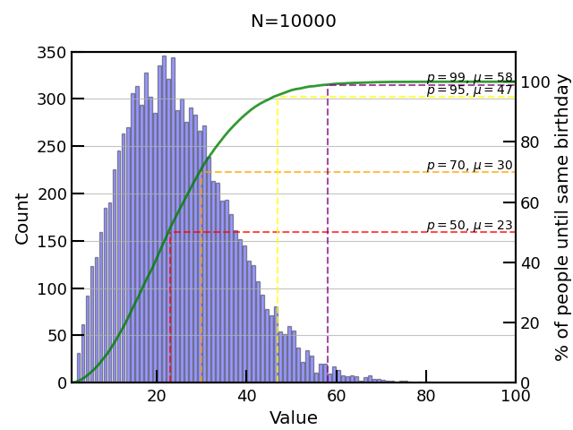

Every so often the birthday problem comes up, whether it be in conversation, at a party, in the media, or overhearing on the train, I have heard it many times and usually always it results in an interesting discussion. After hearing about it again quite recently and discussing it with someone who would not believe it was true (to be fair it is a veridical paradox, so not intuitive), I thought I would devote a post on it. Besides it is has many real world applications, including hash collisions - which is relevant if you are at all concerned with online security (but especially if you are a crypto enthusiast).

Just in case you are not aware of it, [this Wikipedia page](https://en.wikipedia.org/wiki/Birthday_problem) does a good job of describing it and various ways to analyse it, but the the basic question is: "Given a set of randomly chosen people, $n$, what number do I need to have at least 50% probability that at least two share the same birthday?". If you've never encountered this before you would probably think the number would have to be quite high, and in that case you'd be mistaken, since it is just $n = 23$. That is of course, if you think 23 is a small number - I don't know many 23 year olds who think they are old.

*Only 23, but there are 365 days in a year (ignorning leap years of course), that must be wrong.....* that's how the conversation normally goes. Depending on the mathematical ability of the audience it can be quite difficult to explain how this works out, but the maths is below to show how it works.

Let us denote the probability that at least two people in the group of size $n$ have the same birthday, as $P(n)$. Conversely, we can also denote the probability that **no** two people in the group share the same birthday, as $\bar{P(n)}$. These two are then mutally exclusive (we cannot have both occuring, and if one occurs the other cannot), therefore we have:
$$
P(n) = 1 - \bar{P(n)}
$$

We can leverage this relationship to make our lives much easier, since in turns out that computing $\bar{P(n)}$ is much easier than $P(n)$. Let's go through this one by one to understand how we can work it out.

First, let's start with only 1 person in the room, that is, $n=1$. It is then obvious that we have:
$$
P(1) = 0
$$
$$
\bar{P(1)} = 1
$$

Now a second person walks in the room, $n=2$. This person has a $\frac{1}{365}$ ($<3$%) chance that they share the same birthday. Therefore, we have:
$$
P(2) = \frac{1}{365} \sim 0.003
$$
$$
\bar{P(2)} = \frac{364}{365} \sim 0.997
$$

OK, so still quite simple. Let us now add a third person. In order to have a match they need to have the same birthday as either person 1 **or** person 2, **but** this assumes that there was no match for $P(1)$ or $P(2)$, and this is where it becomes a bit more tricky, we have to count all these probabilities up and account for different paths, which of course is possible, but it is simpler to deal with no matches, as I will show.
$$
P(3) = P(2) + (\bar{P(2)} \times \frac{2}{365}) = \frac{1}{365} + (\frac{364}{365} \times \frac{2}{365}) \sim 0.008
$$
and for the "no match" probability we have
$$
\bar{P(3)} = \frac{364}{365} \times \frac{363}{365} \sim 0.992
$$

For the match probability, $P(3)$, we had to account for the fact that there could have been a match with $P(2)$, and in probability we represent this as an addition ($+$), and the second term then arises from the fact that it could have matched with person 1 ($\frac{1}{365}$ chance) or with person 2 (again, $\frac{1}{365}$ chance) and we sum these to get $\frac{2}{365}$ which is then weighted by the probability of not matching with two people $\bar{P(2)}$. Still following?

However, using the not match probability, $\bar{P(3)}$, it was much simpler - it was just the product of $(1 - \frac{1}{365})$ and $(1 - \frac{2}{365})$. You start to see the pattern now.
$$
\bar{P(n)} = (\frac{364}{365}) \times (\frac{363}{365}) \times (\frac{362}{365}) \times .... \times (\frac{n-1}{365})
$$

times by one to make this more obvious
$$
\bar{P(n)} = (\frac{365}{365}) \times(\frac{364}{365}) \times (\frac{363}{365}) \times (\frac{362}{365}) \times .... \times (\frac{n-1}{365})
$$

We can write this as
$$
\bar{P(n)} = \left[\frac{365 \times 364 \times 363 \times ... \times (n-1)}{365^{n}}\right]
$$

$$
\bar{P(n)} = \frac{365!}{365^{n}(365-n)!}
$$
Where we use $k!$ to denote factorial of $k$, i.e. $4! = 4 \times 3 \times 2 \times 1$.

Therefore 
$$
P(n) = 1 - \left[\frac{365!}{365^{n}(365-n)!}\right]
$$

In the table below I chose some examples to see how it changes as $n$ increases. You can see it drops off fast. Two important things to notice here is, $n=23$ is the magic number I told you about earlier (highlighted in bold), and secondly, it is near impossible to not find a match 365 people. Even at $n=120$ you've got more chance of winning the Euromillions Jackpot (as of August 2021) $P_{lottery} \sim 7.15 \times 10^{-9} \gt \bar{P(n)} \sim 2.44 \times 10^{-10}$!

| $n$ 	| $P(n)$| $\bar{P(n)}$ 	|
|--:	|------	|------------	|
| $1$| $0.0$	| $1.0$	|
| $2$| $2.73973 \times 10^{-3}$	    | $9.97260 \times 10^{-1}$	|
| $3$| $8.20417 \times 10^{-3}$	    | $9.91796 \times 10^{-1}$	|
| $4$| $1.63559 \times 10^{-2}$	    | $9.83644 \times 10^{-1}$	|
| $5$| $2.71356 \times 10^{-2}$	    | $9.72864 \times 10^{-1}$	|
| $10$ | $1.16948 \times 10^{-1}$	| $8.83052 \times 10^{-1}$	|
| $15$ | $2.52901 \times 10^{-1}$	| $7.47099 \times 10^{-1}$	|
| $20$ | $4.11438 \times 10^{-1}$	| $5.88562 \times 10^{-1}$	|
| $22$ | $4.75695 \times 10^{-1}$	| $5.24305 \times 10^{-1}$	|
| $\bold{23}$ | $\bold{5.07297 \times 10^{-1}}$	| $\bold{4.92703 \times 10^{-1}}$	|
| $50$ | $9.70374 \times 10^{-1}$	| $2.96264 \times 10^{-2}$	|
| $100$  | $1 - 3.07249 \times 10^{-07}$ | $3.07249 \times 10^{-07}$	|
| $150$  | $1 - 2.45122 \times 10^{-16}$ | $2.45122 \times 10^{-16}$	|
| $364$  | $1 - 5.31059 \times 10^{-155}$| $5.31059 \times 10^{-155}$	|
| $365$  | $1 - 1.45496 \times 10^{-157}$ | $1.45496 \times 10^{-157}$	|
| $\geq366$  | $1.0$ | $0.0$	|

In the below plot I show this on a linear y scale with a marker at $n=23$, $P(23) \sim 50$%. But to see the real detail for $n \gt 100$ we need to plot on a logarithmic scale for y, see second plot below.


We must remember that the question is, any pair, it is not the same question as saying with your specific birthday (see the "Same birthday as you" problem), this is of course a much higher number of people needed ($n = 253$), and is often the first place of confusion with this problem.

OK, so this assumes 365 days in a year (ignoring leap years) and assumes uniform distribution of birthdays, which we know is not the case. The latter effect is an interesting thing to look into, and varies depending on culture and country but mostly more babies are born in the summer and more between Tuesdays and Fridays due to planned operations. Many people have looked at this, and it's really cool to look at but we ignore all that in this case for simplicity. Some researchers have actually looked into these effects and they only seem to have neglible effects on $n$, and a uniform distribution actually provides the highest $n$. *This statement actually is quite intuative since to minimise the chance of birthday collision we want to spread our distribution as best as possible, any other distribution would naturally increase the chance of a collision.*

---

This is the point where everyone normally ends it and be done with the simple maths, but I think that is not enough. I will now take a different approach to the problem, an experimentalists view, if you will. Instead of analytically calculating the probabilities, can we perform an experiment (or series of experiments) to show this is actually true? 

Just to clarify, I will not be inviting large groups of random people into my house and count them, I will simply write a small program to illustrate this effect (we will use python for simplicity, but if we want to run large scale simulations, C++ would be better for this). This will be a very simple Monte Carlo simulation (something we like to do a lot of in Particle and Nuclear Physics).

At the heart of every Monte Carlo Simulation is a random number generator, so let's start with that.

```python
def generate_birthday():
    """Generate an integer in [1, 365] uniform dist"""
    return randint(1, 365)
```

We are going to (incorrectly) assume there are no leap years and birthdays are uniformly distributed, which we know is not correct, but works as a first attempt and matches with the mathematical approach earlier.

Now we can run a simulation, using this generator. This is equivalent to us taking one sample. You can think of each call to this function as us asking people to come into a room until we have a match and then count the number of people in the room.
```python
def count_until_match():
    """Count until we have a match!"""
    # at least one person always
    birthdays = [generate_birthday()]

    # keep adding people until we find a match
    while birthdays[-1] not in birthdays[:-1]:
        birthdays.append(generate_birthday())

    # only need the count, not all the birthdays
    return len(birthdays)
```

Of course, one sample is not going to work - we need lots of samples! The bigger the sample the more representative of our "true" distribution (thanks to the law of large numbers). Something like this:

```python
def mc(nsamples=1000):
    return [count_until_match() for _ in range(nsamples)]
```

And that's basically it! Running this for 100 experiments we already start to see the pattern, but not quite enough statistics. We get $n=21$, so not quite right.


1,000 experiments is a bit better and we get the magic $n=23$! Ta-da, no maths, just some brute force computation - to prove those disbelivers the maths is true! 


However, the distribution is a bit weak. Let's try more events!

10,000 and 100,000 experiments start to give better results and smoother cumulative probability (green line). *I know, I should show statistical error bars on my histogram here.*




We can go to a million (takes a few minutes on single core) but still we don't get many if any events above $n=80$. Remember from our table the probability around $n=100$ of no match, $\bar{P(100)} \sim 3 \times 10^{-7}$! And even running 3.3 million experiments would maybe only yield us 1 count or so around $n=100$, so clearly we have a problem around the tail. 


It turns out that this is a common problem in physics too, most of the time we are interested in the very rare events and want to examine them in isolation. And in those cases there is no analytical solution, so we have to use MC methods. In those cases we have techiques such as reweighting and other variance reduction methods. Hopefully if I have time I will do a part II to show how we can apply such a technique to this problem. It would also be interesting to examine different distributions, include leap years, and look at smarter MC techniques in part II. For now I leave it here.

Final thought - while in this case MC was not really necessary, since the maths was easy, it is a very useful tool when you have no analytical way of solving a problem or equation and since compute power is cheap, **just throw CPUs at the problem** (or GPUs too!).

*All the code to reproduce these plots can be found on this [gist](https://gist.github.com/thomasms/2fdeb1f0dee980182310c1866d1516e9)*

The end.
