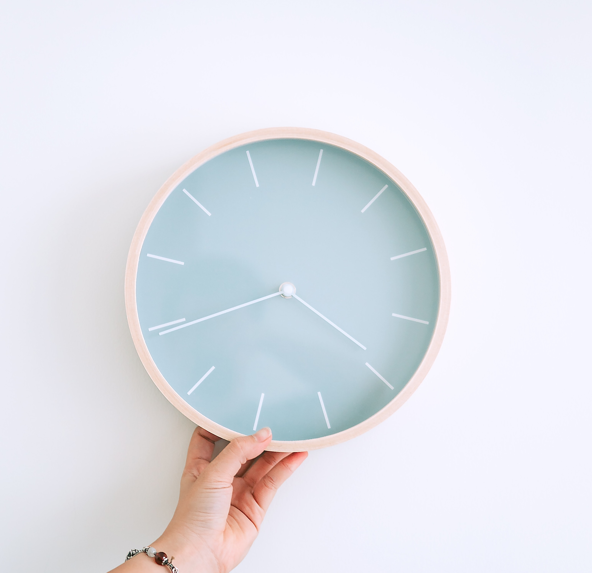
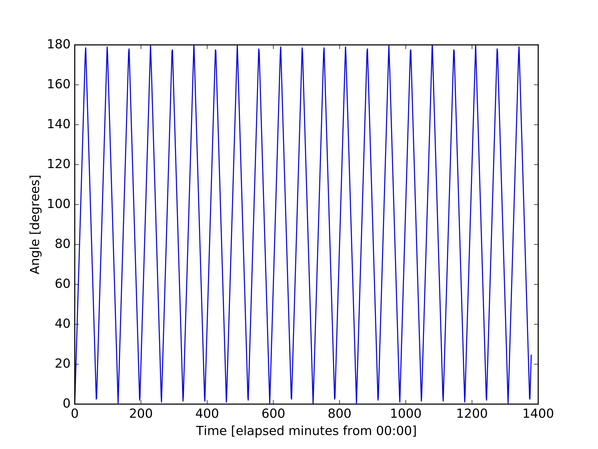

I was once asked in an interview to calculate the angle between the minute and hour hands on a clock for the time 16:34. This was tricky to do in my head but possible given 2 simple facts. 

<ul style="list-style-type:square;margin-left:50px;margin-right:50px">
  <li>The <b>minute hand</b> moves <b>6 degrees for every minute</b>, since we have 360 degrees for one revolution and 60 minutes in an hour, hence 360/60 = 6 degrees/minute. </li>
  <li>The second is that the <b>hour hand</b> moves <b>30 degrees for every hour</b>, again 360 degrees and now 12 hours in one revolution, hence 360/12 = 30 degrees/hour. </li>
</ul>

However, the <b>hour hand also moves 0.5 degrees for every minute</b>, since the hour hand covers 30 degrees in 60 minutes. 
Well knowing this we can then simply do 34 X 6 degrees = 204 degrees for the minute hand and (4 X 30 degrees) + (34 X 0.5 degrees) = 137 degrees for the hour hand. Thus, we have (taking the small angle) a difference of <b>67 degrees</b>, or 1.17 radians if you prefer.

The obvious follow up question was then - <b>What is the time when the hands next cross?</b> Well to answer this I have plotted the angle as a function of time (in minutes). 



We can see from printing out the times at which the angle is a minimum gives us 17:27 (to the nearest minute). The full list of cross over times are:

| Time(HH:MM)  |  Angle (Deg) |
| :----: | :----: |
| 00:00 | 0.0 |
| 01:05 | 2.5 |
| 02:11 | 0.5 |
| 03:16 | 2.0 |
| 04:22 | 1.0 |
| 05:27 | 1.5 |
| 06:33 | 1.5 |
| 07:38 | 1.0 |
| 08:44 | 2.0 |
| 09:49 | 0.5 |
| 10:55 | 2.5 |
| 12:00 | 0.0 |
| 13:05 | 2.5 |
| 14:11 | 0.5 |
| 15:16 | 2.0 |
| 16:22 | 1.0 |
| 17:27 | 1.5 |
| 18:33 | 1.5 |
| 19:38 | 1.0 |
| 20:44 | 2.0 |
| 21:49 | 0.5 |
| 22:55 | 2.5 |


Alas, I didn't get the job in the end, but for anybody who has this question, or is simply curious next time they are staring at the clock, the vanilla Python script (version 3 compatible) below should help.

```python
import math

#constants
twoPi = 2.0*math.pi
maxDegree = 360.0
secondsInHour = 60
minutesInHour = secondsInHour
hoursInDay = 24
maxHour = math.ceil(hoursInDay/2)
```

```python
class Clock():
    def __init__(self, hour, minute, radians):
        self.hour = hour
        self.minute = minute
        self.radians = radians
        self.factor = twoPi
        if not radians:
            self.factor = maxDegree
        
        self.validateTime()
    
    def validateTime(self):
        if self.hour > hoursInDay - 1 or self.hour < 0:
            raise ValueError('Time must be valid - check hours')
        
        if self.minute > minutesInHour - 1 or self.minute < 0:
            raise ValueError('Time must be valid - check minutes')
                        
    def __str__(self):
        return "Standard time is: {}, Time in minutes : {}, , Angle: {}".format( 
            self.getTimeStandardAsString(), 
            self.getTimeInMinutes(), 
            self.computeAngle())            
    
    def getTimeStandardAsString(self):
        timeInMinutes = self.getTimeInMinutes()
        hours = str(math.floor(timeInMinutes/minutesInHour))
        mins = str(timeInMinutes % minutesInHour)
    
        if len(hours) == 1:
            hours = "0" + hours
            
        if len(mins) == 1:
            mins = "0" + mins
            
        return hours + ":" + mins
    
    def getTimeInMinutes(self):
        return self.hour*minutesInHour + self.minute
    
    # every minute moves the minute hand by 6 degrees
    def computeMinuteAngle(self):
        return self.minute*self.factor/minutesInHour
    
    # every hour moves the hour hand by 30 degrees and each minute moves the hour hand by 0.5 degrees
    def computeHourAngle(self):
        # convert to non 24 hour (between 0 and 12 only)
        simpleTimeHour = self.hour
        if simpleTimeHour > maxHour:
            simpleTimeHour = simpleTimeHour - maxHour
    
        return (simpleTimeHour*self.factor + self.computeMinuteAngle())/maxHour
        
    def computeSmallAngle(self):
        minuteAngle = self.computeMinuteAngle()
        hourAngle = self.computeHourAngle()
    
        angle = abs(hourAngle - minuteAngle)
        
        return min(angle, abs(self.factor - angle))
    
    def computeLargeAngle(self):
        return self.factor - self.computeSmallAngle()
    
    def computeAngle(self):
        return self.computeSmallAngle()
```


If we then plug in the desired time, 16:34, behold we get 67 deg.
```python
clock = Clock(16,34, False)
print(clock)
```
