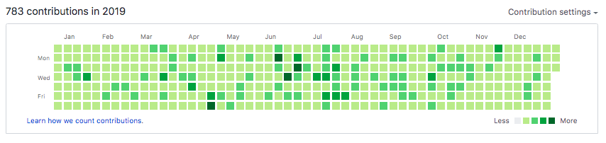
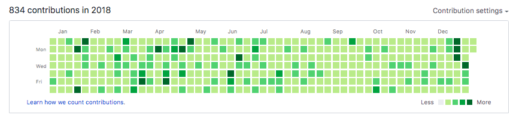
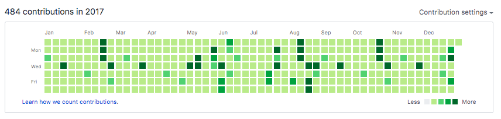
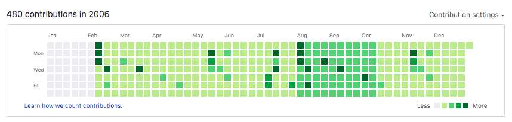

I recently heard that prospective employers and recruiters have started looking at the GitHub commit panel (the green coloured squares on your profile) to screen and gauge potential candidates. Whilst I hope this is certainly not true, mainly because it is a completely nonsense way to recruit, more and frequent commits do not make you a better developer (maybe the opposite?), it got me thinking - can we abuse this panel?

Git allows you to make "past" commits, put simply, that is, make commits in the past. Initially this blew my mind, but of course it actually makes perfect sense. The main reason that I can see for git allowing this is that it can be relatively common to port other/legacy codes with all their history to another version control system and that provenance is important. By virtue of symmetry this also works forward in time, if you were wondering.

For example if today is 7th March 2020, I can in theory make a commit that is from an earlier date, let's say 3rd June 2019, by doing the following:
```bash
GIT_AUTHOR_DATE=2019-06-3T15:03:34 GIT_COMMITTER_DATE=2019-06-3T15:03:34 git commit -m "my old commit ..."
```

_Note: Don't use this on any actual repository you care about!_

Now before I discovered this trick my GitHub was a little bare. I have periodic sessions of heavy commits, followed by periods of silence. This is mainly because I have a busy life, but also because most of my work and development happens on other hosting services and typically on private repositories (which don't show commits). However, that is no longer the case, it is now well and truly clear that I am close to open source burn out from looking at my profile. I challenge you to find a missing day.

Using a simple script to commit at least once a day all the way back to 2006 allowed me to look very busy.

Last year was not bad.

**2019**


**2018**.


**2017**.


I even can go back further than when I joined GitHub (which was 2014 I think). 

**2006**.

Actually I think GitHub was not founded until late 2006, so you can see this is a blatant cheat. But is it cheating? I like to think of it more as bending the rules. It is no secret that git allows you to do this and in the end if anyone thinks these green boxes are useful for anything other than artwork, then they are grossly mistaken and you do not want to work at a company using such silly metrics to recruit.  

As said already - caution when using this trick on a real repository. I recommend only using this on "dummy" repositories - I created a dummy repository just for this case. You can see the repository [here @ https://github.com/thomasms/commitment](https://github.com/thomasms/commitment) which at the time of writing stands at a formidable 20,945 commits. Then to clean this up, and restore honesty (if you will), simply delete the repository and no one will ever know.
