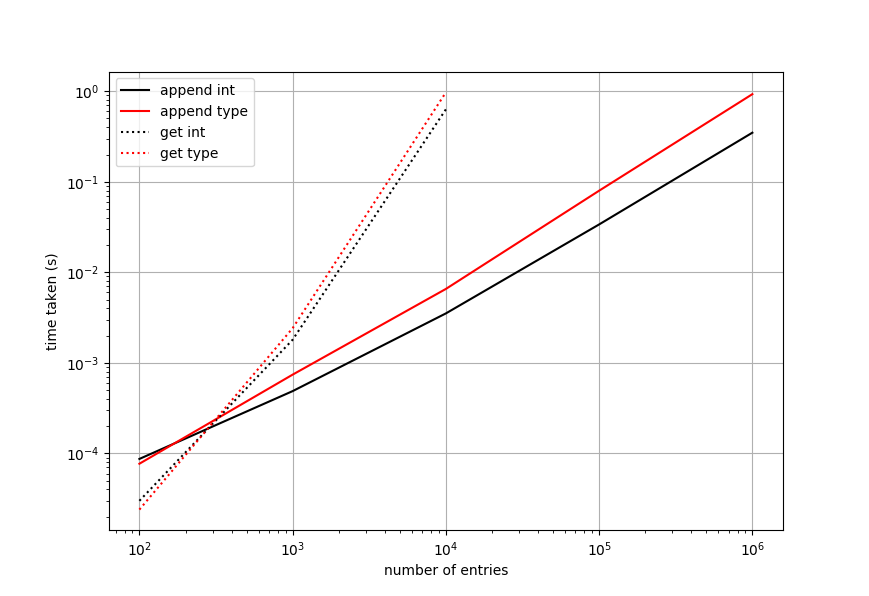

Whilst I enjoy programming in Python and C++, it is envitable that I have to do some development work with Fortran for time to time. The number of code bases still in Fortran in the scientific and research sector is overwhelming. Life is not all bad though the "newer" standards (2003/2008) have now been supported by most compilers and most people using Fortran today will try and at least use some of these new features.

Since Fortran 2003 supports some Object Orientated (OO) features, such as encapsulation and inheritance, although it is not true OO. It allows you to define type bound procedures such as

```fortran
type, public :: my_type
private
    integer(ki4) :: value 
contains
    procedure :: getvalue
    procedure :: setvalue
end type my_type
```

with corresponding implementation defined as

```fortran
!> getter
integer(ki4) pure function getvalue(this)
    class(my_type), intent(in) :: this

    getvalue = this%value
end function getvalue

!> setter
subroutine setvalue(this, newvalue)
    class(my_type), intent(inout) :: this
    integer(ki4), intent(in) :: newvalue

    this%value = newvalue

end subroutine setvalue
```

Note the use of <b>intent(in)</b> for getter and <b>intent(inout)</b> for setter - very important when defining your interface. 


Also note that I used <b>integer(ki4)</b> as we should correctly define what type of integer we want, in this case a 4 byte integer (int or long in C++). I always use the [fork](https://github.com/thomasms/fork/blob/master/fork_m.F90) module definition as below.
```fortran
integer, parameter, public :: ki4 = int32
```


<h1>Linked list in Fortran</h1>
Now I promised you a linked list but instead have rambled on about type bound procedures and integer kinds, well to define a linked list I am going to define a few types within a module, named <b>linked_list</b>.

Lets define the module

```fortran
!> Module for linked list in fortran
module linked_list_m
    use fork_m      !< I need my kind definitions, so again I use the fork_m
    implicit none
    private

    ! type definition and implementation goes here

end module linked_list_m
```

A linked list is made of nodes, and each node then points to the next node (we are covering just a singly linked list here) and the node contains a value. If I find the time I will create a diagram for illustration purposes.
For this we need to use pointers since we need to point to some object/data in memory. Pointers in Fortran are not quite the same as pointers in other languages i.e. C/C++, but as with all pointers we must protect ourselves and Fortran is no different. 

We start by making a small type that wraps a generic pointer (an unlimited polymorphic pointer) to hold the address of the value of the node, and a pointer of the node type to point to the next item in the list. We aptly name this type - <b>LinkedListNode</b>.
```fortran
!> list node type - takes ownership of deallocation of the value pointer in finalize
type, public :: LinkedListNode
    class(*), pointer               :: value    => null()
    type(LinkedListNode), pointer   :: next     => null()
contains
    final :: nodefinalize
end type LinkedListNode
```

Notice we have initialised the pointers to null, this is good practice since if not done we cannot check if they are null or not (which is vital for the list to work). In addition we have added a finalisation (a bit like a destructor in C++) to cleanup the memory allocation and set the pointers to null again. This protects us a bit from leaks and issues with null checking. You will also note that I have been a bit lazy and exposed the pointer (it is public) and therefore in theory it can be changed, ideally we need to encapsulate this to protect us but it will do for now.

Next the list. Ignoring the comments at the top for the minute (we will come to that) we have defined a type and some type bound procedures which might come in handy. Let's take a look at it and then go through it in detail.

```fortran
!> list type - takes ownership of deallocation of the value pointer in finalize
!! Note - do not copy lists, i.e. list1 = list2, this causes memory issues, always pass by reference
!! Do not return a list from a function
type, public :: LinkedList
private
    integer(ki4)                  :: size = 0_ki4
    type(LinkedListNode), pointer :: head => null()
    type(LinkedListNode), pointer :: tail => null()
contains
    procedure :: append
    procedure :: first
    procedure :: last
    procedure :: atindex
    procedure :: reset
    procedure :: length
    procedure :: traverse
    procedure, private :: cleanup
        final :: listfinalize
end type LinkedList
```

We have first defined a head and tail node for our list. They should be self-explanatory, the head points to the first item in the list, and the tail points to the last item in the list. If our list is empty they both point to null, if it is of size 1 then they both point to the first (and last) item. For lists of longer lengths they then differ in terms of where the point. The head position should not change once we add the first item. And yes they are both pointers. You can think of them as book ends.

The size member variable keeps track of the list size to save us time iterating through it when we query its length. Note that we have made these private, correctly encaspulating our data and are accessed via the type bound procedures: first, last, and length for head, tail, and size respectively. 

Other type bound procedures are needed to add an item at the end (append), reset the list to zero (reset), iterate through the list (traverse), and get a node at a given index (atindex). The latter is actually an awful procedure in terms of performance and should not really be there, but I have added it for education purposes. Just imagine if we had a list of 10,000 elements and we wanted the one at index 8,723, we would have to access all the previous 8,722 nodes beforehand - very slow. This does not scale well. It is actually surprising how many people use linked lists for everything in Fortran (because of dynamic allocaation they argue) and therefore grinding their application (even in production) to a halt for large data structures. I strongly advise against using linked lists for any data storage > 1000 items. I will show some benchmarks later on to motivate this reasoning.

There is also a private method (cleanup) which does exactly as it states, deallocates each node in the list and resets the size to 0. It is private since we don't want the user to see this, the user does not own it, we clean up behind the scenes. Both reset and listfinalize (the destructor) will use this private method.

Now having described what we need let's implement it.

For the list node we just need to implement the destructor. Remeber for this we use <b>type</b> not <b>class</b> with intent(<b>inout</b>) since it is modifying the type and Fortran final procedures are not polymorphic.
```fortran
!> LinkedListNode destructor
! Clean up node - The value is deallocated here
subroutine nodefinalize(this)
    type(LinkedListNode), intent(inout) :: this

    ! check for allocation and cleanup if needed
    if(associated(this%value))then
        deallocate(this%value)
        nullify(this%value)
        nullify(this%next)
    end if
end subroutine nodefinalize
```

For the list itself, the <i>first</i>, <i>last</i> and <i>length</i> methods are trivial getters. The length method can be pure also.
```fortran
!> Get the size of the list
pure function length(this) result(size)
    class(LinkedList), intent(in) :: this
    integer(ki4) :: size

    size = this%size

end function length
```

```fortran
! Get the first node
function first(this) result(firstnode)
    class(LinkedList), intent(in) :: this
    type(LinkedListNode), pointer :: firstnode

    firstnode => this%head

end function first
```

```fortran
! Get the last node
function last(this) result(lastnode)
    class(LinkedList), intent(in) :: this
    type(LinkedListNode), pointer :: lastnode

    lastnode => this%tail

end function last
```

The <i>append</i> method. Without this the list is useless. It gives the power of dynamic allocation which so many Fortran developers crave.
It is not too complex but requires some description, which the comments hope to do.
```fortran
!> Add a value to the list at the tail
subroutine append(this, value)
    class(LinkedList), intent(inout) :: this
    class(*), intent(in), pointer    :: value

    ! temp pointers
    type(LinkedListNode), pointer :: node_ptr
    type(LinkedListNode), pointer :: current_ptr

    ! Create a new node and set the value
    ! Remember the list owns the memory here
    ! so it does the allocation
    allocate(node_ptr)
    node_ptr%value => value
    node_ptr%next => null()

    ! increment the size
    this%size = this%size + 1_ki4

    ! if it is the first then both head and tail point 
    ! to the new item
    if(.not. associated(this%head))then
        this%head => node_ptr
        this%tail => node_ptr
    ! otherwise just change the tail
    else
        ! previous tail points to null
        ! so we need to move it along
        ! to point to newly added item
        this%tail%next => node_ptr
        ! the tail is now the new item
        ! this%tail%next => null() now
        this%tail      => node_ptr
    end if

end subroutine append
```

Then the controversial <i>atindex</i> method.
```fortran
! Get the node at index
! must be between 1 and length()
function atindex(this, index) result(indexnode)
    class(LinkedList), intent(in) :: this
    integer(ki4), intent(in)      :: index
    type(LinkedListNode), pointer :: indexnode

    integer(ki4) :: i

    nullify(indexnode)
    if(index > 0_ki4 .and. index <= this%size)then
        indexnode => this%head
        do i=1, index-1
            indexnode => indexnode%next
        end do
    end if

end function atindex
```

And then the important <i>traverse</i> method, which allows us to apply a function to each node in the list, passing in an iterator function with the interface matching as below.
```fortran
interface
    subroutine iterator_func(node)
        import LinkedListNode
        type(LinkedListNode), pointer, intent(inout)  :: node
    end subroutine iterator_func
end interface
``` 
Note the intent(inout) here as it is not a const iterator (we should also do this too) since we will see in a short moment that we want to modify these nodes in the list.

With the full function as below.
```fortran
!> Traverse the list
subroutine traverse(this, iterator_func)
    class(LinkedList), intent(inout) :: this
    interface
        subroutine iterator_func(node)
            import LinkedListNode
            type(LinkedListNode), pointer, intent(inout)  :: node
        end subroutine iterator_func
    end interface

    type(LinkedListNode), pointer :: current_ptr, temp_ptr

    current_ptr => this%head
    do while(associated(current_ptr))
        nullify(temp_ptr)
        temp_ptr => current_ptr%next
        call iterator_func(current_ptr)
        current_ptr => temp_ptr
    end do

end subroutine traverse
```

I will then use this method to implement our private <i>cleanup</i> method which is called by <i>reset</i> and the list destructor. Remember I said we need to modify the nodes in the iterator? Well we will use <i>traverse</i> to deallocate each node in the list.
```fortran
!> Clean up - deallocation of the nodes in the list
subroutine cleanup(this)
    class(LinkedList), intent(inout) :: this

    type(LinkedListNode), pointer    :: current_ptr

    call this%traverse(destroyall)
    nullify(this%head)
    nullify(this%tail)

    contains
        subroutine destroyall(node)
            type(LinkedListNode), pointer, intent(inout)  :: node

            this%head => node%next
            deallocate(node)
            nullify(node)

            this%size = this%size - 1_ki4

        end subroutine destroyall

end subroutine cleanup
```

And voila we easily can define the remaining methods below.
```fortran
!> Reset the list and cleanup
subroutine reset(this)
    class(LinkedList), intent(inout) :: this

    call this%cleanup()

end subroutine reset

!> Clean up - deallocation of the nodes in the list
subroutine listfinalize(this)
    type(LinkedList), intent(inout) :: this

    call this%cleanup()

end subroutine listfinalize
```

OK, so there we have it if you want the full code go to (not Fortran goto) my GitHub page and find the fortsraw repo. The direct link to the source code for a linked list is [here](https://github.com/thomasms/fortsraw/blob/master/fortsraw/linked_list/linked_list_m.F90).
FortsRaw is an attempt to provide a set of generic containers for Fortran that are typical and common in the STL. So far only a linked list is there but in follow up posts I will add hash tables, vector like containers using macro (preprocessor) tricks to provide primative templates in Fortran.

For a quick benchmark on my machine here are some quick results. The append times make sense - 10 X the number of elements to append 10 X the time taken. The get method however, was done on each element and shows how computational bad it is to access an element by index when using a linked list. After 10,000 entries it becomes unfeasible to access the elements. This is a rough benchmark but the conclusion is obvious an append is cheap, it is simply one more allocation and moving the final pointer, whereas accessing the $N^{th}$ index means accessing the $N-1$ elements. Not good. Please refrain from using linked lists in Fortran, they rarely are the correct data structure. This was put here as an academic exercise only to show you how bad they are. They also cannot be vectorized!



Oh and of course this needs unit testing, which has been done on that repository. I used my unit testing library [TOAST](https://github.com/thomasms/toast) to unit test it. TOAST will be the subject of another post too.