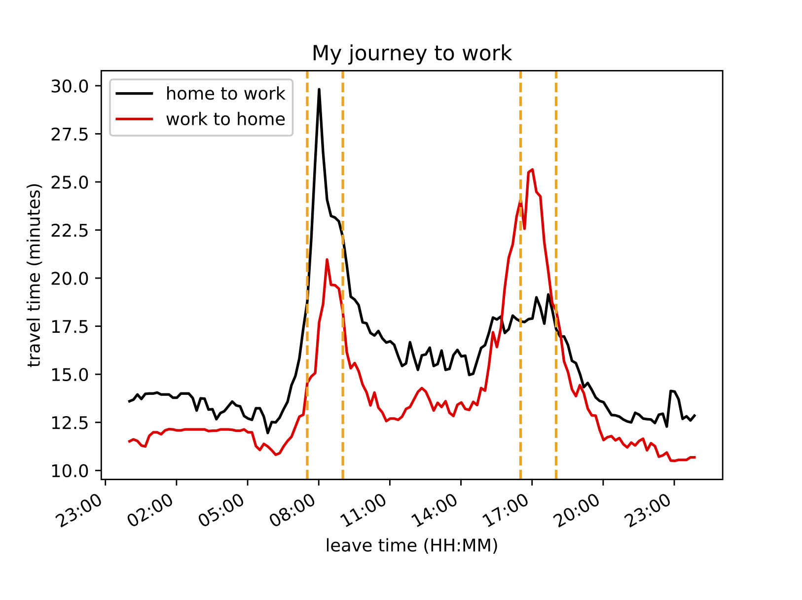
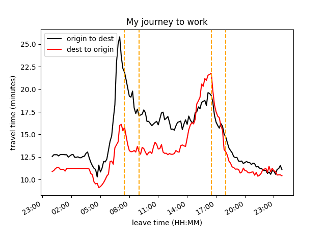

Back in March 2019, I posted a small entry on using Google directions APIs to determine the optimal commute time to and from work. The previous post is [here](../killercommute).

I set my home address and work address via postcodes and ran the script which called the API 288 times (increments of 10 minutes over 24 hours in both directions). When I ran this for a Thursday (not half-term) back in March I got the following plot.

However, running it for the same day in September shows a similar distribution but now translated roughly an hour earlier, as below. 

It now seems favourable to leave later, which whilst suggesting I can hit snooze a bit longer, I don't think is a true reflection of reality. I suspect this is likely due to a lack of accurate training data for their models, since schools have just returned and the summer holiday break prior to this week, may have skewed the data. But I remain optimistic and assume Google are smart enough to account for seasonal effects. It seems closer examination is needed to investigate seasonal, or even weekly effects, in the data through more thorough use of the API. Though this will likely exceed my Google Cloud budget via a brute force method. I will leave this for a potential follow up post, a part III, once I envisage a smarter, less financially demanding analysis.

By the way, the code I used to make this plot is available on my Github [here](https://github.com/thomasms/trafficwatch) and all it requires is an API key. Sadly these used to be free, but now require an account with an associated credit card linked to it. You can sign up to the Google Cloud platform and get $300 dollars free worth of credit, this is quite generous and will allow you to run the script many times though!