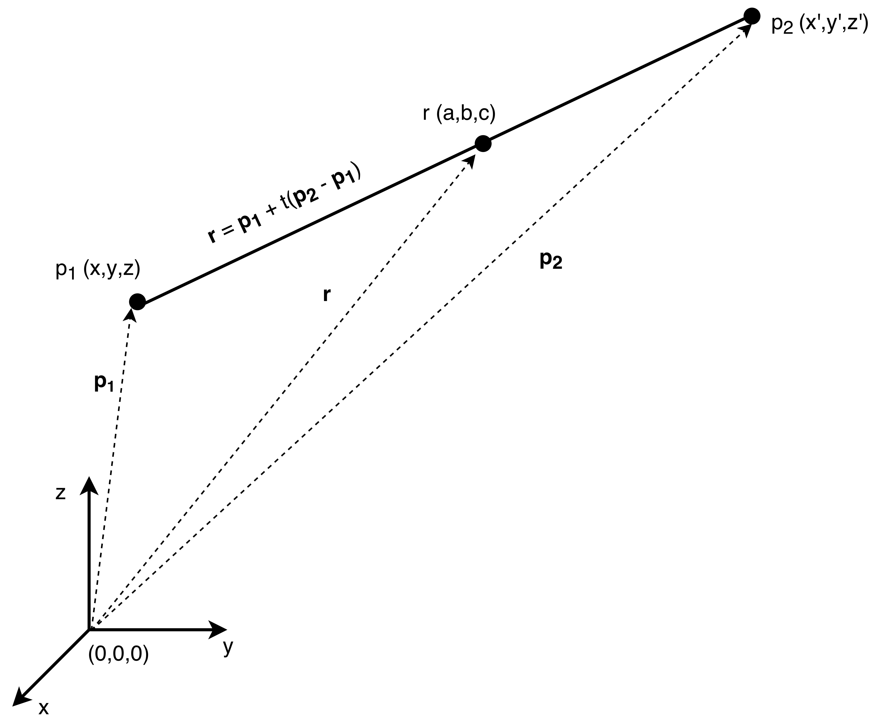
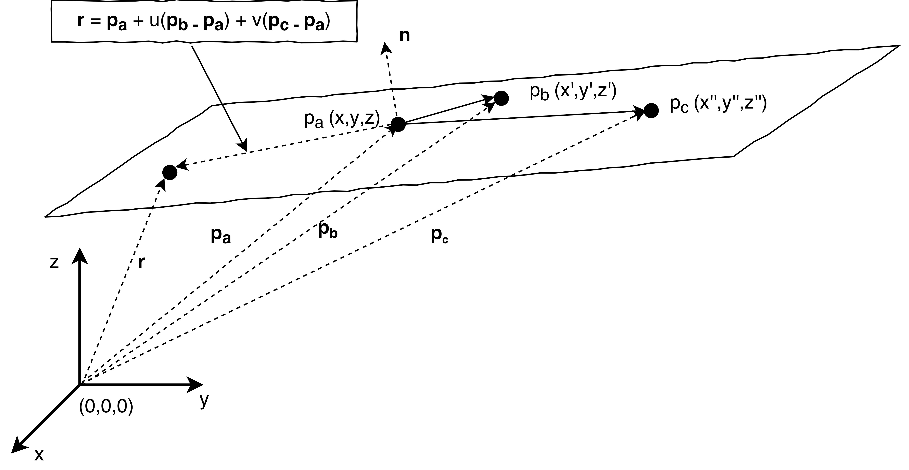

This was always a nice problem to solve involving vectors and linear algebra. Given two points dictating the line and three points defining the plane, at what point (if any) does the line intersect the plane?

First, let's go through the vector equation of a line. I've drawn out a sketch involving the points $p_{1}$ and $p_{2}$ and the vectors they create with respect to the origin $\mathbf{p_{1}} = [x_{1}, y_{1}, z_{1}]^{T}$ and $\mathbf{p_{2}}= [x_{2}, y_{2}, z_{2}]^{T}$ respectively.

The point $r$is then a general point on the line, which is parameterised by the scalar quantity $t$.

A sketch showing the vector equation of a line defined by the points $p_{1}$ and $p_{2}$. A general point on the line, r, can then be determined from the 2 vectors that the points make with the origin.

From examination of this sketch it is then clear that our vector equation of the line, or put another way, the vector $\mathbf{r}$ which points from the origin to the general point on the line $r$, is then $\mathbf{r} =\mathbf{p_{1}} + t(\mathbf{p_{2}} -\mathbf{p_{1}})$.

Here $t$ is unknown and if it is such that $0 \leq t \leq 1$, then it lies between the points, otherwise it lies on the line outside of these points.

Now for the plane. This may look slightly more complicated from the sketch but in reality it is not much different. We require three points to define a plane, since now we have an extra degree of freedom. I've labelled these 3 points as $p_{a}, p_{b}, p_{c}$. The vectors $\mathbf{p_{a}},\mathbf{p_{b}},\mathbf{p_{c}}$, then define these points with respect to the origin. The vector $\mathbf{n}$ defines the normal vector to the plane, such that $(\mathbf{p_{b}} -\mathbf{p_{a}})\cdot\mathbf{n} = 0$. Now, the point $r$ is then a general point on the plane, which is parameterised by the scalar quantities $u$ and $v$.

A sketch showing the vector equation of a plane defined by the points $p_{a}$, $p_{b}$, and $p_{c}$.

Thus, we can write the vector from the origin to the general point in the plane $r$ as
$$
\mathbf{r} =\mathbf{p_{a}}+ u(\mathbf{p_{b}} -\mathbf{p_{a}}) + v(\mathbf{p_{c}} -\mathbf{p_{a}}).
$$

For the intersection we must equate the two vector equations for a general point in the line and in the plane.
$$
\mathbf{p_{1}} + t(\mathbf{p_{2}} -\mathbf{p_{1}}) = \mathbf{p_{a}}+ u(\mathbf{p_{b}} -\mathbf{p_{a}}) + v(\mathbf{p_{c}} -\mathbf{p_{a}})
$$
or as,
$$
\mathbf{p_{1}} -\mathbf{p_{a}} = t(\mathbf{p_{1}} -\mathbf{p_{2}}) + u(\mathbf{p_{b}} -\mathbf{p_{a}}) + v(\mathbf{p_{c}} -\mathbf{p_{a}}).
$$

Since we know the points $p_{1}, p_{2}, p_{a}, p_{b}, p_{c}$ we can then solve for the parameters $t,u,v$ by writing it in the form
$$
\left(\begin{array}{c}x_{p_{1}} - x_{p_{a}}\\y_{p_{1}} - y_{p_{a}}\\z_{p_{1}} - z_{p_{a}}\end{array}\right) = \left(\begin{array}{ccc}x_{p_{1}} - x_{p_{2}}& x_{p_{b}} - x_{p_{a}} & x_{p_{c}} - x_{p_{a}} \\y_{p_{1}} - y_{p_{2}} & y_{p_{b}} - y_{p_{a}} & y_{p_{c}} - y_{p_{a}} \\z_{p_{1}} - z_{p_{2}} & z_{p_{b}} - z_{p_{a}} & z_{p_{c}} - z_{p_{a}}\end{array}\right) \left(\begin{array}{c}t\\u\\v\end{array}\right)
$$

Which then is in the form of $\mathbf{Y} =\text{A} \mathbf{X}$, where $\mathbf{X}$ is the vector containing the 3 unknown parameters $t,u,v$ and $A$ is the matrix which we will need to invert, in order to solve the system of equations. However, in the case the matrix is singular, that is, it has no inverse, it tells us that the line and the plane do not interact. Either the line lies in the plane or it is parallel to the plane but does not lie in the plane. For this example let's assume it does intersect and therefore have an inverse, we then have $\mathbf{X} =\text{A}^{-1} \mathbf{Y}$.

Once we have computed the inverse we only need to know the parameter $t$ to compute the interaction point by putting it back into our line equation. Thus our intersection point is,
$$
\mathbf{r_{i}} =\mathbf{p_{1}} +((\text{A}^{-1} \mathbf{Y})\cdot\hat{\mathbf{x}})(\mathbf{p_{2}} -\mathbf{p_{1}}) .
$$

A quick python script I made some time ago aims to tackle this. It can be found [here](https://github.com/thomasms/problems/blob/master/line_and_plane_intersection.py).