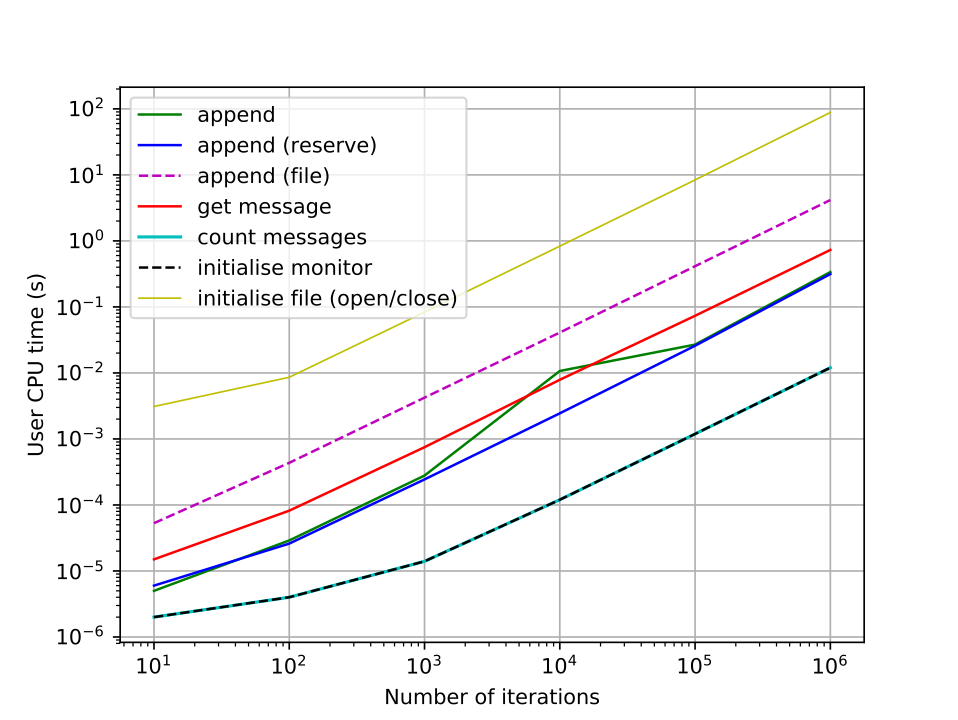
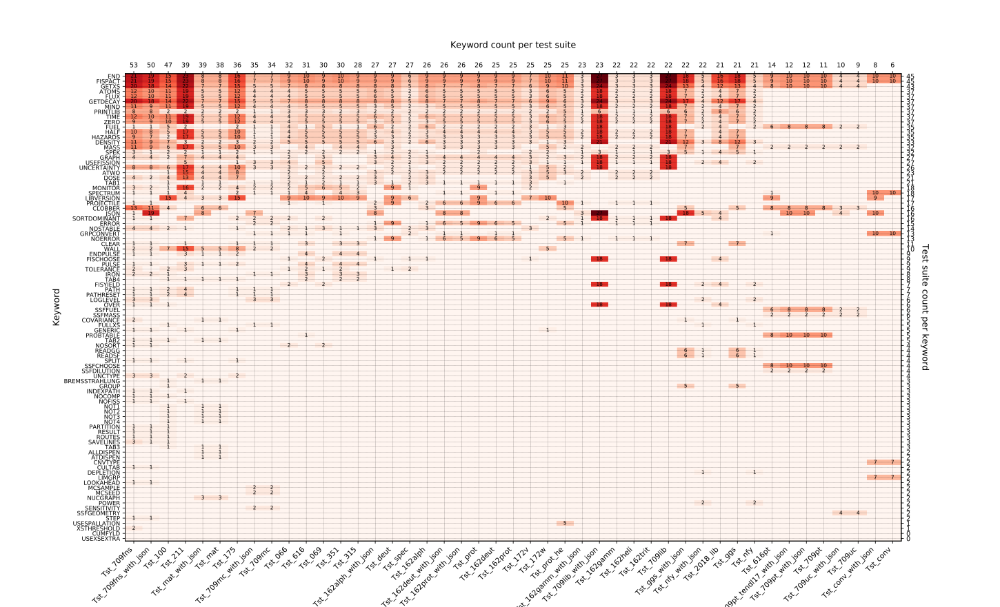
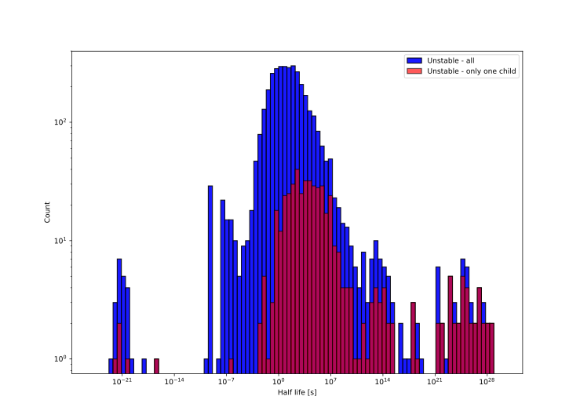
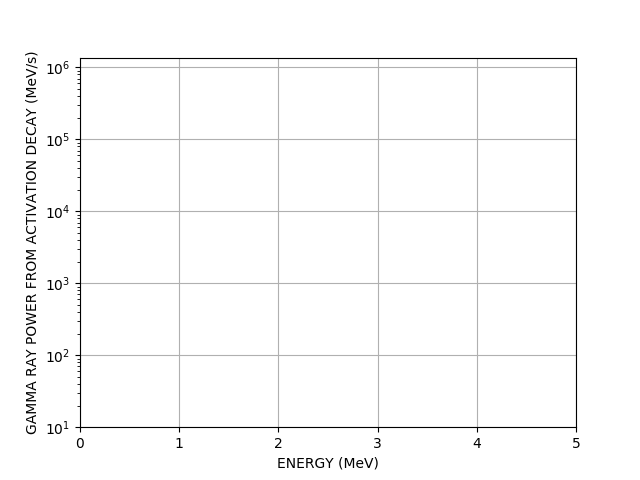
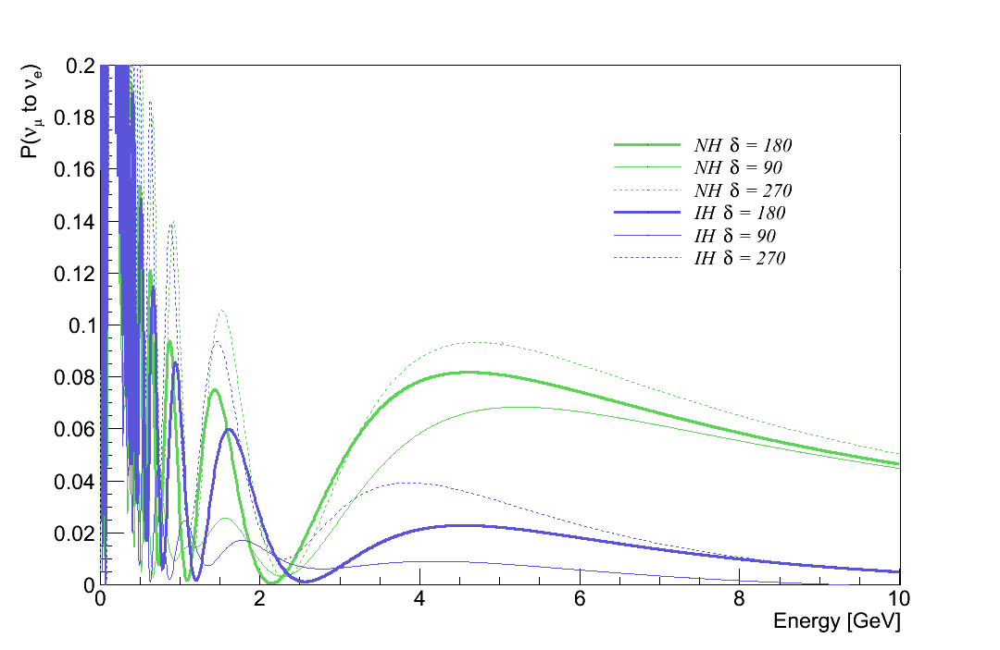
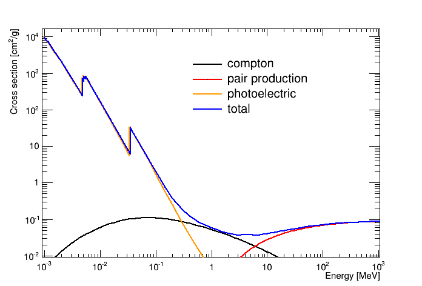
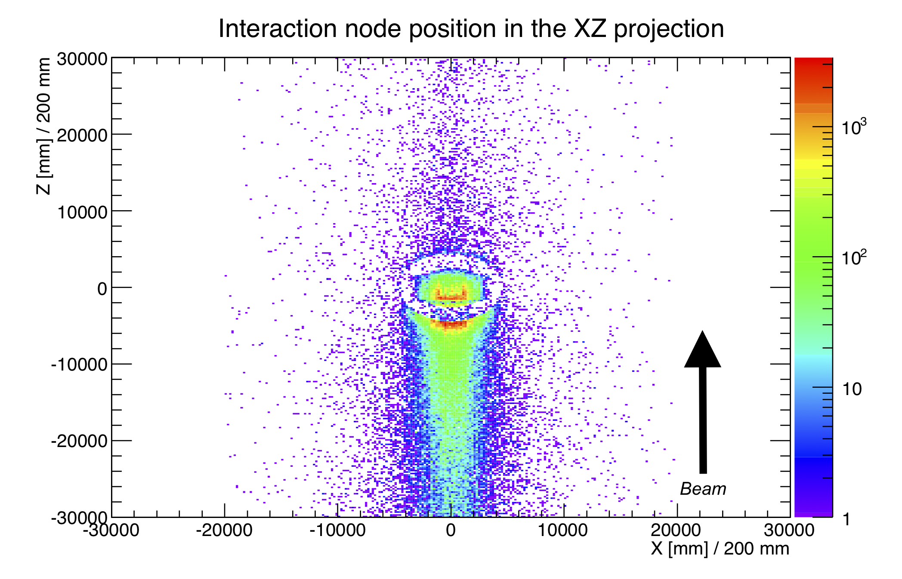

When it comes to plotting with python Matplotlib is the de facto library and I must admit that I am an avid user of it. I wouldn't call myself a power user or an expert but I like to think I have pushed it to some of its boundaries a few times. It really is so good for doing simple plots. If I want to quickly look at some data and examine a trend, or do a quick and dirty analysis then without question matplotlib is the go to guy. You may even recognise some of the plots in this blog as classic matplotlib. It can also do animations fairly straightforward, which is a nice little assest. However, it soon breaks down miles before you begin to touch big data, and those animations can take a long time to load. Additionally, it is very hard to disguise a matplotlib plot and most are instantly obvious to where their origin lies. Here are a few nice examples of a classic matplotlib plots I made for various reasons.

A simple line plot for comparing run times.

A matrix plot for showing keyword coverage in FISPACT-II system tests.

A histogram (log binning) for halflives of all unstable nuclides in TENDL 2015.

I mentioned animations, well here is one of a gamma spectrum decaying as a function of time from a FISPACT-II run.

I like to think some of them are beyond standard matplotlib usage, but certainly not advanced. All of those plots required less than 100 lines of code (for the plotting that is).

Prior to my heavy python usage I was a very comfortable C++ user and due to my particle physics upbringing, I was very strongly dependent on ROOT (CERN). I would use ROOT to do almost anything, run scripts, heavy analysis and indeed make plots. In fact all my research during my PhD and my thesis is littered with ROOT histograms - the famous TH1 histogram which is a monster class! Looking back it is never good to be so dependent on a library and especially a plotting library. ROOT is great and is very powerful - you may recoginse the famous Higgs boson discover plot from Atlas and CMS <a href="https://root.cern.ch/higgs-plots">plots here</a>. These were indeed all ROOT plots, albeit with many customisations. I still use ROOT from time to time but I have become annoyed with its overboard object orientation (OO) and allowing classes to plot and do analysis (breaking SOLID) - just have a look at the <a href="https://root.cern.ch/doc/master/classTH1.html">TH1</a> class, it does so much. Remember the S - Single Repsonsibility Principle, things should have one reason to change, that class has much more than one reason. Anyway here are some examples of ROOT in action taken from my thesis.

The effect of $\delta_{CP}$ and matter effects on the LBNO baseline.

The gamma cross section on Xenon as a function of energy due to different interactions. 

Neutrino interactions based on MC simulations in and around the LBNO near detector.

Can you spot the differences between ROOT and matplotlib from looking at the plots?

One thing I can tell you for certain is that ROOT is far quicker to produce plots and can handle much larger data sets. Even that simple gamma spec animation took a while to save the gif. Now while ROOT is designed for big data analysis it is also designed for particle physics experiments where almost 90% of data is represented in histograms, leaving little room for other plot types. Of course it can do others such as graphs and scatter plots but I feel matplotlib is much more expressive. What I actually want is the D3.js equivalent for python (I can dream).

This leaves me with a choice between speed and expressiveness which I don't like to make - I want speedy and powerful plots which allow me to do heavy customisation. I want to be able to add text wherever possible, I want to use log binning, I want matrix plots out of the box, I want overlapping plots, multiple axes on the same figure, multiple figures, hell I want animations that are quick and look good. All in all I want to be able to script it easily using Python3 (ROOT has python bindings). 

At my current place of work, many colleagues use either matplotlib or GNU plot. The latter is actually very powerful (makes very pretty plots) and it is quite quick, but the main reason I do not use it is because it does not have a native python library or any bindings (and I do not mean a series of execute commands) and is horribly dependent on data in a file. So if I do some analysis I must write a file to disk, subsequently read from said file and then do my plot. I have many problems with this workflow. So GNU plot is not an option. 

Another candidate is <a href="https://plot.ly/">plotly</a>. Plotly is actually very good and makes very, very pretty plots, but whilst it is open source and has a free tier, ultimately the paid option is far superior and I am not paying. Of course the free tier is pretty good apart from it gives you a tool bar which cannot be removed and always shows it is from plotly. Also you cannot save to eps or pdf files on the free tier - definitely a no. 

The final candidate to replace or at least act as a backup to my two other libraries is <a href="https://bokeh.org/">Bokeh</a>. It seems to match all of my criteria and does indeed make pretty plots. It runs fast due to a canvas plotting approach (I think) and is very customisable, I feel this could be the one. I will abruptly end here as I am now very conscious about the time and need to draw this to a close. I intend to follow this up with some example plots and my experience of learning and using Bokeh in a later post.
