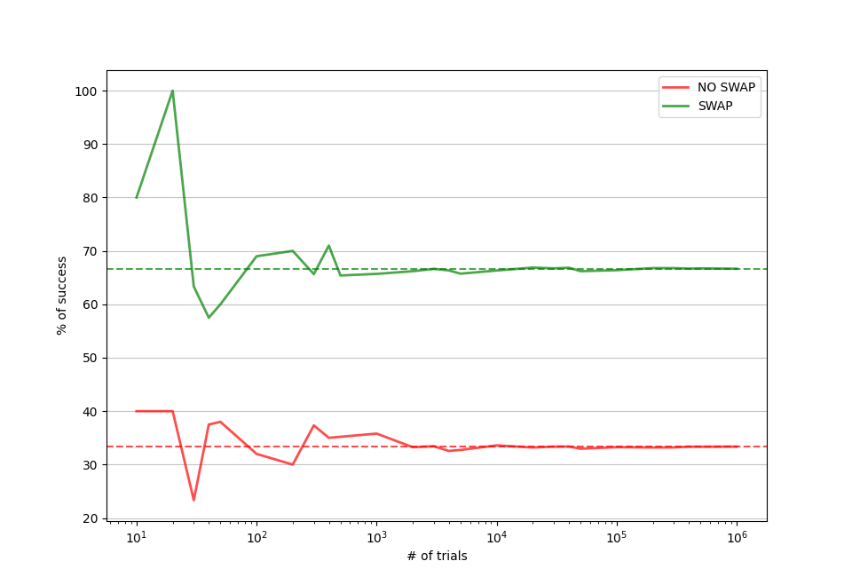

We've all heard the famous Monty Hall problem (https://en.wikipedia.org/wiki/Monty_Hall_problem), or at least, some variation of this. You are shown 3 boxes, 1 has a money prize in it while the other two have nothing - nada, zilch. Of course, you need your car fixed so you want the box with the cash in it, so you choose a box, and one third of the time (on average) you win - not great odds, right? But the twist is that after you choose one box, it is not opened, the presenter eliminates one of the remaining two boxes (knowing which one has cash in it), and gives you the option to swap or stay with your box, armed with this new knowledge. The question is, is it better to swap or stick with your original box?

The optimal option is indeed to swap, giving you 2/3 chance of winning. This is the counter-intuative result, as naively, and incorrectly, you would think (and as many mathematicians have also reasoned), that it is a 50-50 chance, regardless of this new information - a box without cash was removed. Well this new information does in fact actually swing your odds to 2/3 of winning, by changing boxes.

The purpose of this post is not to show the standard reasonings shown everywhere on the internet, but instead illustrate this result via experiment, i.e. via Monte Carlo simulations. So Monty Hall meets Monte Carlo.

In python we can write a simple function to simulate one game using uniform distribution sampling, as below.
```python
def one_game(
    swap: Optional[bool] = False, nboxes: Optional[int] = 3
) -> int:
    """
    Swap will remove all but your box and one other box.
    Returns 1 if we win, 0 if we lose.
    """
    chosen_box = randint(1, nboxes)
    money_box = randint(1, nboxes)
    first_pick_correct = money_box == chosen_box
    return int(first_pick_correct ^ swap)
```

The logic is fairly simple, we randomly assign one box to the contestant by generating an integer between 1 and 3 (this is `chosen_box`). Similarly we then assign one box with the money (`money_box`), following the same procedure. For example, `chosen_box` could be 2 and money_box could be 1, in this case 3 would be eliminated and obviously swapping would be the best outcome. Conversely, if the money box was instead 2, then it the host could either eliminate 1 or 3, in this case, with the best outcome not to swap. These are just two examples to show how the code works. Once random numbers are assigned we then check if the two random numbers are equal (just as we described before) and then perform an `XOR` (exclusive `OR`) operation with if we chose to swap.

Note that we use a uniform distirbution for sampling both integers, as we are assuming that in this game all boxes have equal probability of being selected, as in the original Monty Hall problem. You would get different results for different distributions.

Let's look at some possibilities of what could happen in this function, with some examples shown in the table below.

| `chosen_box`  |  `money_box` | `first_pick_correct` | `swap` | result |
| :----: | :----: |:----: |:----: |:----: |
| 1 | 2 | False | False | NO WIN |
| 1 | 3 | False | True | WIN |
| 3 | 3 | False | True | NO WIN |
| 2 | 2 | False | False | WIN |

It is obvious that one game alone will not show us the average case, in order to do that we need to run millions of games! This will give us an approximation for the expectation value, and hopefully with some confidence we can show it should be 66.66666666666667% if we swap and 33.333333333333% if we don't swap.

This small function will do that for us.

```python
def run_simulation(
    trials: int, nboxes: Optional[int] = 3
) -> Tuple[float, float]:
    """
    Runs the MC for N trials with swap and N trials without a swap.
    Returns a tuple of the mean win rates for no_swap and swap, respectively.
    """
    no_swap = np.array(
        [one_game(nboxes=nboxes, swap=False) for _ in range(trials)],
        dtype=float,
    )
    with_swap = np.array(
        [one_game(nboxes=nboxes, swap=True) for _ in range(trials)],
        dtype=float,
    )
    return np.mean(no_swap), np.mean(with_swap)
```



As you can see from the above plot it starts to converge very quickly and by $N=1000$ we are almost at the expected values. As we go to a million, it seems there is little difference between the expected and result returned from the experiements. If we print the exact values for the million we have 33.36% for no swap, and 66.66% for swap. Not bad for a few lines of python and 10 seconds of computation. Much easier than writing some clever mathematics and huge lines of proofs.

I should point out that the rate of not swapping + swapping does not exactly equal 100% because these are two different statistical experiements, one for control and one the result. As we increase the number of trials we do see them converge to close to 100% but as shown above, it is not exact.


Eagle eye readers will have noticed that I allowed the number of boxes to be configurable in both functions. By default it was 3, but we can easily change this to another number, say 100, and see what happens. In this case, the gameshow host would then eliminate all but 2 of the boxes.
What do you think, is swapping still worth it or would you stay put?

Well it is easy to figure this one out without any computation, surely you are much less likely to have picked the winning box out of 100 first time, so swapping will almost always be the best option, 99% of the time in fact. But don't take my word for it, try running that function for 1 million trials with 100 boxes and see for yourself!


Well, there you have it, the Monte Carlo method has once again shown how simple it is to put maths into action and resolve arguments between mathematicians in a few lines of python.