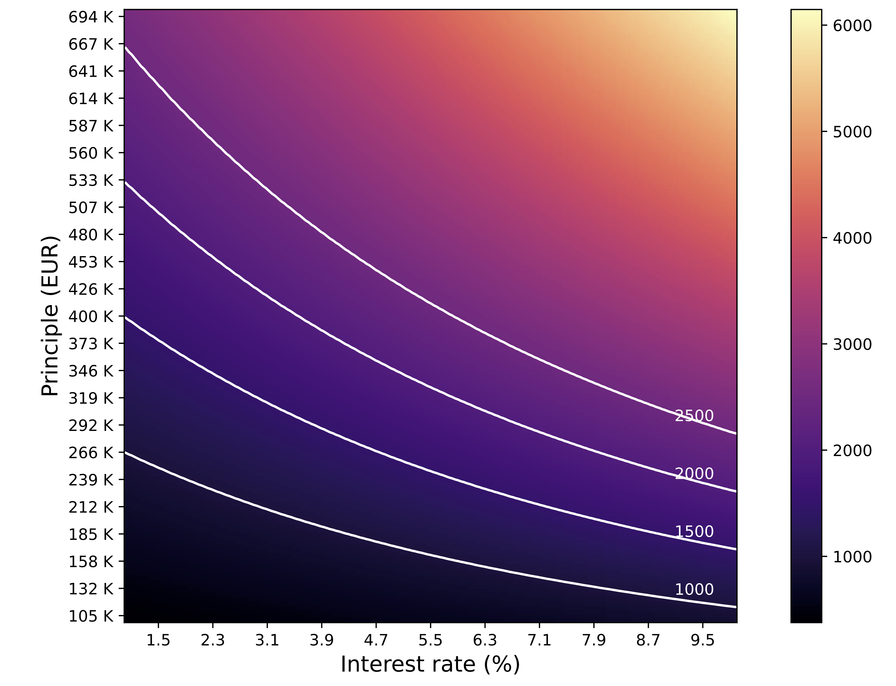

I always get annoyed when finacial products are sold to you without any explaination of how they come to these magical numbers. When you question the sales person how these figures came out, they always come back blankly with "it's very complicated but our system does it for us". Hogwash. The problem can always be broken down and understood, it is just they are unwilling to explain it, or normally, simply unable to explain it. I bringeth an example on mortgages.

A friend recently asked me to help understand their mortgage proposal from the bank, and I gladly met the challenge. He explained that the bank produced a spreadsheet with monthly payments but no explaination on how this was calculated and he wanted to know how it works.

The main reason for this understanding was so that he could play with the rates and principle amounts without everytime having to ask the bank to "simulate" a new proposal.

It was quite easy to do, once I was given the correct information on the rates and understood how payments are fixed per month. Before I explain the process of how this was done, I will present the formula below.

$$
\alpha_{m} = (1 + \alpha_{y})^{\frac{1}{12}} - 1
$$
$$
X_{m} = \frac{P(1+\alpha_{m})^{n}}{\sum_{i}^{n-1}{(1+\alpha_{m})^{i}}}
$$

Where $X_{m}$ is the monthly payment, $P$ is the loan principle (how much you want to borrow from the bank), $\alpha_{y}$ is the annual interest rate, $\alpha_{m}$ is the monthly interest rate, and $n$ is the number of payment periods.


### The code

Below is a python function to compute this for you, with some tricks to deal with rounding.

```python
def get_interest_per_month(interest_rate_per_year: float) -> float:
    interest_rate_per_month = (1.0 + interest_rate_per_year) ** (1.0 / 12.0)
    # we do not consider anything more than 1e-5 for rate
    interest_rate_per_month = round(interest_rate_per_month, 5)
    return interest_rate_per_month - 1


def get_monthly_payment(
    principle: float, interest_rate_per_year: float, period_in_years: int
) -> float:
    """
    Takes the interest rate per year and the number of years and calculates the monthly payment.
    The interest rate is converted to a monthly rate.
    """
    period_in_months = period_in_years * 12
    interest_rate_per_month = get_interest_per_month(interest_rate_per_year) + 1.0
    d = sum(interest_rate_per_month**i for i in range(period_in_months))
    # anything less than a penny is dropped
    return (
        int((principle * (interest_rate_per_month**period_in_months) / d) * 100) / 100
    )
```

Before we see how this can be derived let's see if it works by looking at an example.

### Example

Principle, $P$, of £300,000 (which is scarily almost the UK average price), and a modest interest rate of 1.6% over 25 years.

Using this function we get a monthly payment of £1211.68, assuming that this would stay fixed for the 25 years. You can verify by running the above function as below:

```python
get_monthly_payment(300_000, 0.016, 25)
>> 1211.68
```

Now let's see what happens when Liz Truss ruins the economy and interest rates jump up to 5.6% when you want to remortage. For the same principle and same period we now get a slightly different result of £1835.10 per month! So an increase of 4% on the rate means an increase of over £600 per month (roughly 50% of your previous payments).


```python
get_monthly_payment(300_000, 0.056, 25)
>> 1835.10
```

Note that in the first case the total interest for the full loan and period is £63,504 (21.17% of the principle amount), whereas in the latter case this is 83.51% of the principle amount, at £250,530 in interest!


### Plotting

To show a visual representation of how the monthly payments change with the interest rate, we can plot this as below.




The code used to generate this plot can be found below. Note this uses the above function `get_monthly_payment`.


```python
from matplotlib.figure import Figure
import matplotlib.pyplot as plt
import numpy as np

def plot_2d() -> Figure:
    fig, ax = plt.subplots()

    principle_range = np.linspace(100_000, 700_000, 201)
    interest_range = np.linspace(1.0, 10.0, 201)
    period = 25

    mat = np.zeros((len(principle_range), len(interest_range)))

    for i, p in enumerate(principle_range):
        for j, r in enumerate(interest_range):
            mat[i, j] = get_monthly_payment(p, r * 0.01, period)

    im = plt.imshow(mat, cmap="magma", interpolation="nearest", origin="lower")

    xloc, _ = plt.xticks()
    yloc, _ = plt.yticks()

    xloc = np.linspace(xloc[0], xloc[-1], 15)
    yloc = np.linspace(yloc[0], yloc[-1], 29)

    xmin, xmax = 0, len(interest_range) - 1  # xloc[0], xloc[-1]
    ymin, ymax = 0, len(principle_range) - 1  # yloc[0], yloc[-1]

    new_x = np.interp(
        interest_range, (interest_range.min(), interest_range.max()), (xmin, xmax)
    )

    def add_contour(monthly_rate: float, color="w") -> None:
        _, yy = get_principle_vs_interest_rate(
            monthly_rate, interest_range * 0.01, period
        )
        new_y = np.interp(
            yy, (principle_range.min(), principle_range.max()), (ymin, ymax)
        )
        plt.plot(new_x, new_y, color)
        plt.text(
            int(len(interest_range) * 0.9),
            new_y[-1] + 4,
            f"{monthly_rate:.0f}",
            color=color,
        )

    plt.xticks(
        xloc,
        [
            f"{n:.1f}"
            for n in np.interp(
                xloc,
                (xmin, xmax),
                (interest_range.min(), interest_range.max()),
            )
        ],
    )
    plt.yticks(
        yloc,
        [
            f"{int(n/1000):} K"
            for n in np.interp(
                yloc,
                (ymin, ymax),
                (principle_range.min(), principle_range.max()),
            )
        ],
    )

    add_contour(1000)
    add_contour(1500)
    add_contour(2000)
    add_contour(2500)

    plt.xlabel("Interest rate (%)", size=14)
    plt.ylabel("Principle (EUR)", size=14)

    fig.colorbar(im)
    return fig
```

### Derivation

Now let's go through the derivation of the original equation at the top of this page.

The best way to derive this is to first make a table of payment periods and see if we can find a pattern, on the understanding that the payment $X$ each period is fixed throughout the whole payment loan period $n$, as is the interest rate $\alpha$. The Principle $P$ is also fixed of course (as this is how much you plan to borrow). Now we can make a table of $i$, to indicate how many payments we have made (each month or year, it doesn't matter at this point), the amount paid off, which is just $iX$, and the amount remaining, $R$.


|  $i$  |  paid off | remaining, $R$ |
| :----: | :----: | :----: |
| 1 | $X$  | $P(1+\alpha) - X$
| 2 | $2X$ | $[P(1+\alpha) - X](1+\alpha) - X$
| 3 | $3X$ | $[[P(1+\alpha) - X](1+\alpha) - X](1+\alpha) - X$

and so on....

If you're willing to follow this and factorise, or just believe me, you will end up with the following for the amount remaining $R_k$ at a given $i = k$.

$$
\begin{aligned}
R_k = P(1+\alpha)^k - X_k\sum_{j=1}^{k-1}(1+\alpha)^j
\end{aligned}
$$

Now before we move on, a quick explanation on how I filled in the remainder column. The idea is that after every payment you're taking off that amount, not from the principle, but from the principle multiplied by the interest (see $i=1$). For $i=2$ we then do the same but now on $R_{1}$, not on $P$ this time, as the idea of compound interest is working against us (unlike for us when we invest). Therefore we have $R_{1}(1+\alpha) - X$ which is actually $[P(1+\alpha) - X](1+\alpha) - X$. Rewriting the table in this way makes it much clearer what's going on.


|  $i$  |  paid off | remaining, $R$ |
| :----: | :----: | :----: |
| 1 | $X$  | $P(1+\alpha) - X$
| 2 | $2X$ | $R_1(1+\alpha) - X$
| 3 | $3X$ | $R_2(1+\alpha) - X$
| k | $kX$ | $R_{k-1}(1+\alpha) - X$


Now back to the earlier equation (I was unable to get the equation label working in markdown) for $R_k$. When $k=n$ we are at the end of our payment period and in theory (if you've not missed any payments) the remainder should be 0. So we have:

$$
\begin{aligned}
0 =P(1+\alpha)^n - X\sum_{j=1}^{n-1}(1+\alpha)^j \\

P(1+\alpha)^n = X\sum_{j=1}^{n-1}(1+\alpha)^j \\

X = \frac{P(1+\alpha)^{n}}{\sum_{j=1}^{n-1}{(1+\alpha)^{j}}}
\end{aligned}
$$

which is what I promised at the start.

Now the only thing remaining is the small issue of annual $\alpha_y$ versus monthly $\alpha_m$ interest rate, which is simply related by $(1 + \alpha_{y}) = (1 + \alpha_{y})^{12}$, or, as I mentioned at the top of this post:

$$
\alpha_{m} = (1 + \alpha_{y})^{\frac{1}{12}} - 1
$$

This is plain to see since interest rates are typically given per annum and therefore after one year of a liability of $A$ you pay $A(1+\alpha_{y})$, but in our calculations we want to know per month.

To be justified better.....