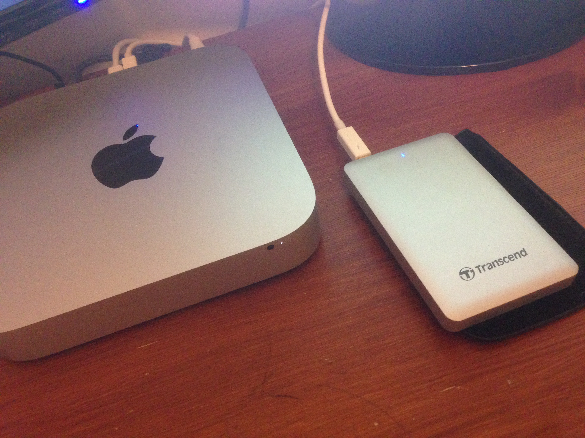

Has your Mac become noticeably slower than when it was a shiny new machine fresh out of the box? Does switching it on feel like a steam locomotive, laboriously and reluctantly moving away from the station, resulting in several minutes of lost time just to get it running? Well my Mac mini (late 2014) certainly began to feel this way recently. It actually got to the point that I would turn it on, walk away and put the kettle on, come back log in and then go back to making my cup of tea, after which upon returning I finally noticed it up and running. The whole process taking in excess of 5 minutes. This is for a Mac which is only 3 years old!

Now I’m generally a patient man, but my patience was wearing thin for my home computer, so I began to seek solutions. Ideally I’d like to keep my machine and didn’t want to fork out for a new machine. I was prepared to spend a little to upgrade and improve my Mac, but I didn’t want to spend over £250. Usually a machine runs slow for a few reasons, the main ones are not enough memory, too slow CPUs and bloated old hard drive. Now since my machine used to be quite quick I didn’t think it was the former two. Although I have some services running on my local machine and added many applications and software to it over time, the memory was ok, and rarely did I hit swap space. Thus I came to the conclusion that it was indeed my bloated old hard drive.

When I bought my Mac I didn’t get the top range with the fusion drive (I thought this was overpriced and not necessary), I got the mid range, 1 TB (5400-rpm) hard drive. I did originally have the intention to upgrade this to an SSD but after researching I put this off. There are many YouTube videos and blogs on how to upgrade the internal hard disk with an SSD, however, none of these guides where easy to follow and involved in excess of 20 steps. Of course you need to buy a bespoke set of tiny screwdrivers. This was not a route I wanted to take. Alas there was another way. With USB3 and Thunderbolt offering speeds of 10 Gbps and 20 Gbps it seemed logical to try an external SSD with Thunderbolt/USB3 capabilities. Why does it need to be internal if we can achieve those speeds? Then putting the OS on that directly and running of an external would make my machine feel like new. Meaning no screws, no YouTube videos and no chance of breaking my machine. The downside? Well, just don’t pull out the cable!

I went with the Transcend 256 GB StoreJet 500 Thunderbolt, from amazon just over £200, and even comes with the Thunderbolt and USB3 cables. In conclusion, my Mac feels fresh and quick, and it’s now portable! I’ve install macOS Sierra on it and all of my applications (it only took 2 hours). I even wrote this blog entry on it.