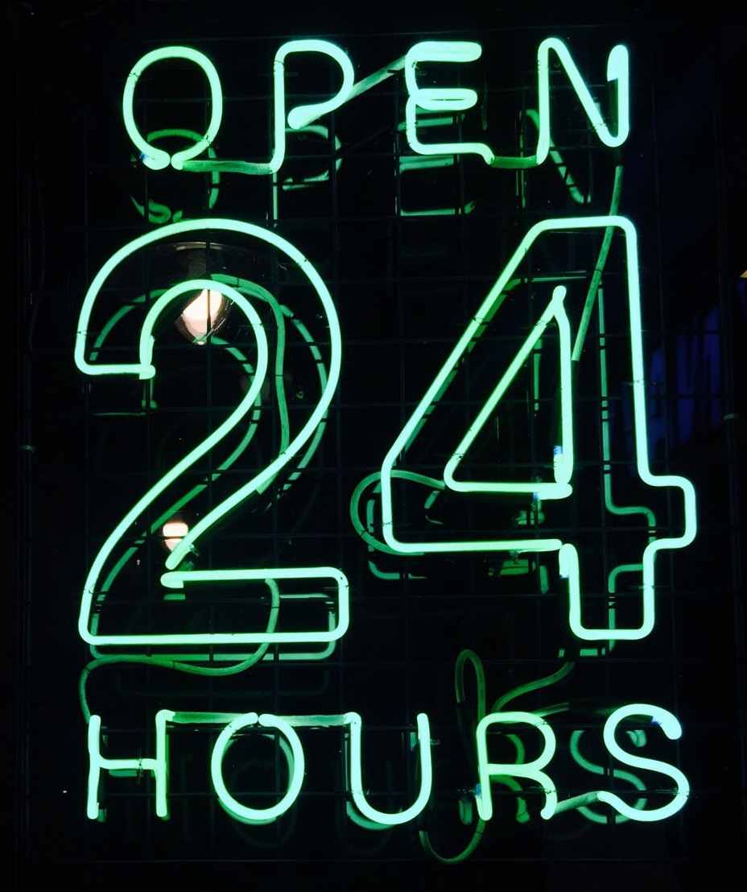

This post is about the number 24, my favourite number. Why? Well, not only was it a great age to be, it is also mathematically interesting for several reasons. 

I first became aware of its elegance when studying String Theory. In bosonic string theory it turns out that the ideal number of dimensions is 24 + 2 = 26, (for reasons not included here, check out Dr David Tongs lecture notes [here](http://www.damtp.cam.ac.uk/user/tong/string/string.pdf)). Yes, not exactly 24 but the additional 2 dimensions are due to the strings dimensions. To arrive at this, we have made use of a truly wonderful and weird result, first intuited by Ramanujan,
$$
\sum\limits^{\infty}_{n=1}{n} = - 1/12
$$.
An entirely counterintuitive result, since summing only positive numbers can lead to a negative number and producing a non integer result! But let's not digress into that - back to our beloved number 24.

It is easy to spot that $4! = (3)(2)^{3} = 24$, which I find aesthetically pleasing, since it involves 2 and 3 and is key to understanding the following proposition involving prime numbers.

<strong><b>Proposition:</b> </strong>If $p$ is a prime number, such that $p >3$, then
$$
\frac{(p^{2} - 1)}{24} = n,
$$
where $n \in \mathbb{Z^{+}}$. 

<strong><b>Solution: </b></strong>This requires two small observations, the first is that $p^{2}-1 = (p+1)(p-1)$, and secondly that $4! = (3)(2)^{3} = 24$. Now it becomes a lot clearer, since $\left\{p\in\mathbb{P}\mid p > 3\right\}$ we know that both $(p+1)$ and $(p-1)$ are even numbers, removing two factor 2's (one for each even number). We can also remove another factor 2 since there is a difference of 2 between those values $(p+1)-(p-1)=2$. That just leaves a final factor of 3. By definition $p$ is prime and hence cannot divide by 3 (for primes larger than 3, as we noted), and since we have a consecutive series of 3 numbers, $(p-1)$, $p$, $(p+1)$, then either $(p+1)$ or $(p-1)$ must then divide by 3. Hence we have proved our initial proposition.

It has other connections to the primes too, as we can see it is the sum of the prime twins 11 and 13, and its divisors are all primes when 1 is subtracted (ignoring 1 and 2 of course). With exactly eight divisors: 1, 2, 3, 4, 6, 8, 12, and 24, it is then the smallest number with eight divisors. It is also a nonagonal number, a Harshad number and a semiperfect number. 
So the next time you are thinking about the hours in a day, the number of carrots representing 100% pure gold, the total number of major and minor keys in Western tonal music or just the atomic number of Chromium, take some time to appreciate its other qualities. 

