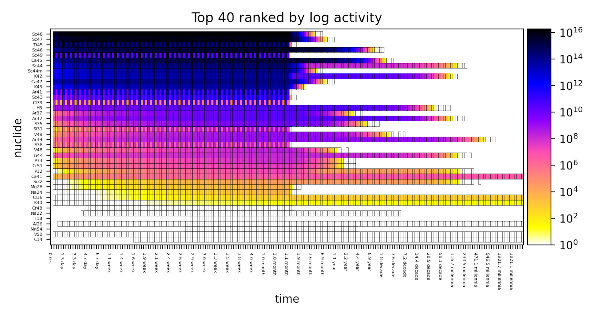

I'd like to finally spend some time talking about one of my ongoing side projects - **pypact**. Whilst I have recently been pursuing a variety of different projects (both open and closed source), this one in particularly has taken a fair share of my spare time in the past months. As it happens with everything, this project started out to solve one specific and niche purpose, more as a proof of concept and never intended to go further than that! Something that started out so simple and lightwieght but now seems to have grown arms and legs, with no way of stopping. Actually, it never intended to see the outside world at all, and was purely meant for internal testing only, however fortunately for you (or just the 4 users worldwide) it is an open source project (Apache-2.0). 

OK, so what is pypact? Well if you're not interested in understanding the decay heat in the vacuum vessel of a fusion reactor after 10 years of operation (or nuclear inventory calculations in general) then pypact will be of little interest to you. However, if you are interested in such calculations, and I am hoping you are, then pypact might be a useful library for you. Pypact’s *original aim* was to make FISPACT-II output files easy to parse so that more time can be spent on analysis, and much less time on interrogating the output file (because the output file is an awful thing for a computer to read). No more convoluted scripts, just one simple to use package! If you don't know what FISPACT-II is then I guess you shouldn't have read further than (decay heat in the vacuum vessel .....) but FISPACT-II is an extremely valueable tool to perform such nuclear inventory calculations, amongst other things. Read more on FISPACT-II [here](https://fispact.ukaea.uk/). As I said earlier, however, pypact has evolved beyond its original aim (a simple parser for FISPACT-II), it provides a utility library for FISPACT-II, not just parsing output files, but also writing input files (fluxes, files, inputs), data manipulation, group convert, plotting, and more! Now I am hoping I have got you interested.

Firstly, I should mention it is a pure python library, so if you are not a python enthusiast then I can't really help you there, although Julia bindings would be nice! So unlike FISPACT-II it is not written in Fortran. If you do love python though and love nuclear irradiation, then pypact is for you. Just look at what you can do with a few lines of python and a FISPACT-II output file.

 


You can even make more complex animations involving the chart of the nuclides and the periodic table (a bit more than a few lines of code), they are too big too show here but take a look [here](https://github.com/fispact/pypact) if you're interested.

Of course animations don't really provide any quantatitive value but can make your presentations look pretty.

Since the documentation for pypact is not great at the current time of writing (check it out [here](https://pypact.readthedocs.io/en/latest/)), I thought this post might help cover some of the basics. With the intention of future posts to show more interesting examples when using pypact.

First, its original purpose - reading a FISPACT-II file.

Let's say you have a FISPACT-II file, named *run1.out* and it looks something like this:

```
   TOTAL ACTIVITY EXCLUDING TRITIUM     0.00000E+00 Bq
0  TOTAL ALPHA HEAT PRODUCTION          0.00000E+00 kW
   TOTAL BETA  HEAT PRODUCTION          0.00000E+00 kW
   TOTAL GAMMA HEAT PRODUCTION          0.00000E+00 kW              TOTAL HEAT PRODUCTION 0.00000E+00 kW
0  INITIAL TOTAL MASS OF MATERIAL       1.00000E+00 kg              TOTAL HEAT EX TRITIUM 0.00000E+00 kW
0  TOTAL MASS OF MATERIAL               1.00000E+00 kg
   DEUTERON FLUX DURING INTERVAL        1.00000E+13 d/cm**2/s
0  NUMBER OF FISSIONS                   0.00000E+00                 BURN-UP OF ACTINIDES  0.00000E+00 %


                                               COMPOSITION  OF  MATERIAL  BY  ELEMENT
                                               --------------------------------------
0                                                             BETA                     GAMMA                     ALPHA
                      ATOMS      GRAM-ATOMS     GRAMS      CURIES-MeV      kW        CURIES-MeV      kW        CURIES-MeV      kW

   22       Ti      1.2581E+25   2.0891E+01   1.0000E+03   0.0000E+00   0.0000E+00   0.0000E+00   0.0000E+00   0.0000E+00   0.0000E+00
1 * * * TIME INTERVAL   2 * * * * * * * TIME IS   3.1558E+07 SECS OR  1.0000E+00 YEARS * * * ELAPSED TIME IS   1.000 y   * * * FLUX AMP IS  1.0000E+13 /cm^2/s  * * *
  NUCLIDE        ATOMS         GRAMS        Bq       b-Energy    a-Energy   g-Energy    DOSE RATE   INGESTION  INHALATION   HALF LIFE
                                                        kW          kW         kW         Sv/hr      DOSE(Sv)    DOSE(Sv)    seconds

  H   1    #  2.59134E+21   4.337E-03   0.000E+00   0.000E+00   0.00E+00   0.000E+00   0.000E+00   0.000E+00   0.000E+00     Stable
  H   2    #  2.79642E+20   9.353E-04   0.000E+00   0.000E+00   0.00E+00   0.000E+00   0.000E+00   0.000E+00   0.000E+00     Stable
  H   3       3.87956E+19   1.943E-04   6.911E+10   6.320E-08   0.00E+00   0.000E+00   0.000E+00   2.903E+00   1.797E+01   3.891E+08
  He  3    #  1.37967E+19   6.910E-05   0.000E+00   0.000E+00   0.00E+00   0.000E+00   0.000E+00   0.000E+00   0.000E+00     Stable
  He  4    #  3.87178E+20   2.573E-03   0.000E+00   0.000E+00   0.00E+00   0.000E+00   0.000E+00   0.000E+00   0.000E+00     Stable
  Na 23    #  3.38730E+05   1.293E-17   0.000E+00   0.000E+00   0.00E+00   0.000E+00   0.000E+00   0.000E+00   0.000E+00     Stable
  Mg 24    #  1.84580E+07   7.351E-16   0.000E+00   0.000E+00   0.00E+00   0.000E+00   0.000E+00   0.000E+00   0.000E+00     Stable
  Mg 25    #  2.53133E+08   1.050E-14   0.000E+00   0.000E+00   0.00E+00   0.000E+00   0.000E+00   0.000E+00   0.000E+00     Stable
```
Horrible, right?

Well, don't worry about that just simply install pypact by:
```bash
#! /bin/bash
pip3 install pypact
```
and then in a few lines you can print the total decay heat at each timestep by doing the following:

```python
#!/usr/bin/env python3
import pypact as pp

filename = "run1.out"

with pp.Reader(filename) as output:
    for inventory in output:
        print(inventory.total_heat) # in kW
```

That's it - 5 lines of code!

We could take this further by only looking at the decay heat of nuclides starting with the letter T, for each timestep in the output. A useless exercise nonetheless but it can show the power of the library and how little effort things like this become.

```python
#!/usr/bin/env python3
import pypact as pp

filename = "run1.out"

with pp.Reader(filename) as output:
    for inventory in output:
        heats = [nuclide.heat for nuclide in inventory.nuclides if nuclide.name.startswith('T')]
        print(sum(heats)) # in kW
```
With a few more lines you can make those COVID-19 style plots that everyone has been showing lately, but this time instead of number of positive cases and "hot" countries we can instead show activity per top nuclides.



Below is the code on how to make the above plot using pypact. Let's break it down.


First we import all the necessary libraries
```python
# essential libs
import os
import math
import numpy as np
from collections import defaultdict

# plotting 
import matplotlib.pyplot as plt
from matplotlib.colors import LogNorm, Normalize
from mpl_toolkits.axes_grid1 import make_axes_locatable

# pypact!
import pypact as pp
```

Now we define some basic parameters for our plot - the file we want to read and the plot styling.
```python
# change the filename here to your particular output file
runname = os.path.join(
    os.path.dirname(os.path.abspath(__file__)), "..", "..", "reference", "Ti.out"
)

MAX_TIMESTEPS = 200
TOP_NUCLIDES = 40
PROP = "activity"
LOG = True
CMAP = "gnuplot2_r"
SHOW_STABLE = False

```
We next need to define some time scales
```python
SECS_IN_HOUR = 60 * 60
SECS_IN_DAY = 24 * SECS_IN_HOUR
SECS_IN_WEEK = 7 * SECS_IN_DAY
SECS_IN_MONTH = 30 * SECS_IN_DAY
SECS_IN_YEAR = 365.25 * SECS_IN_DAY
SECS_IN_DECADE = 10 * SECS_IN_YEAR
SECS_IN_MILLENIUM = 100 * SECS_IN_DECADE


def get_time_unit(time):
    # very dumb code...
    if time < SECS_IN_HOUR:
        return f"{time:.1f} s"
    if time < SECS_IN_DAY:
        return f"{time/SECS_IN_HOUR:.1f} ho"
    if time < SECS_IN_WEEK:
        return f"{time/SECS_IN_DAY:.1f} da"
    if time < SECS_IN_MONTH:
        return f"{time/SECS_IN_WEEK:.1f} we"
    if time < SECS_IN_YEAR:
        return f"{time/SECS_IN_MONTH:.1f} mo"
    if time < SECS_IN_DECADE:
        return f"{time/SECS_IN_YEAR:.1f} ye"
    if time < SECS_IN_MILLENIUM:
        return f"{time/SECS_IN_DECADE:.1f} de"
    return f"{time/SECS_IN_DECADE:.1f} mi"
```


Then this is the bit that actually makes the plot - it is essentially a matrix making use of the Rectangle patches to highlight cells (timestamp and nuclide).
```python
def highlight_cell(x, y, ax=None, **kwargs):
    rect = plt.Rectangle((x - 0.5, y - 0.5), 1, 1, fill=False, **kwargs)
    ax = ax or plt.gca()
    ax.add_patch(rect)
    return rect


def make_mat(output, ax=None, prop="atoms"):
    min_value, max_value = 0.0, 0.0
    nuclides = sorted_top_nuclides(output, ntop=TOP_NUCLIDES, prop=prop)
    ntimesteps = min(MAX_TIMESTEPS, len(output))
    mat = np.zeros((ntimesteps, TOP_NUCLIDES + 1))
    times = []
    for i, timestamp in enumerate(output[:ntimesteps]):
        times.append(get_time_unit(timestamp.currenttime))
        for j, nuclide in enumerate(timestamp.nuclides):
            # find index of nuclide in sorted nuclides
            index = next(
                (n for n, item in enumerate(nuclides) if item == nuclide.name),
                -1,
            )

            if index == -1:
                continue
            mat_value = getattr(nuclide, prop)
            min_value = min(min_value, mat_value)
            max_value = max(max_value, mat_value)
            mat[i, index] = mat_value
            highlight_cell(i, index, ax=ax, color="k", linewidth=1)
    return mat.T, nuclides, times, min_value, max_value


def sorted_top_nuclides(output, ntop=100, prop="atoms"):
    allnuclides = defaultdict()
    for timestamp in output:
        for nuclide in timestamp.nuclides:
            name = nuclide.name
            value = getattr(nuclide, prop)
            # ignore unstable nuclides which have short halflives
            # compared to the timestep - take 10% of timestep here as cutoff
            show_stable = SHOW_STABLE and nuclide.half_life == 0.0
            if value > 0 and (
                (nuclide.half_life > timestamp.duration * 0.1) or show_stable
            ):
                allnuclides[name] = max(allnuclides.get(name, 0), value)

    # sort nuclides based on the property
    sortednuclides = sorted(allnuclides, key=allnuclides.get, reverse=True)
    return sortednuclides[:ntop]
```

Those were the functions we need to make the plot, now we use pypact to read the file (see the `pp.Reader` context manager) and set the labels and axes.
```python
fig, ax = plt.subplots(figsize=(10, 8))

with pp.Reader(runname) as output:
    mat, nuclides, times, min_value, max_value = make_mat(output, prop=PROP, ax=ax)
    # if LOG and max_value > 0:
    #     max_value = math.log10(max_value)
    norm = (
        LogNorm(vmin=max(1, min_value), vmax=max_value)
        if LOG
        else Normalize(vmin=max(0, min_value), vmax=max_value)
    )

    im = ax.imshow(mat, cmap=CMAP, norm=norm, aspect="auto")


titlestr = "log" if LOG else ""
plt.title(f"Top {TOP_NUCLIDES} ranked by {titlestr} {PROP}")
plt.xlabel("time", fontsize=18)
plt.ylabel("nuclide", fontsize=18)

# show only every nth tick
ticktimes = [time if i % 5 == 0 else "" for i, time in enumerate(times)]
ax.set_xticks(np.arange(len(ticktimes)))
ax.set_xticklabels(ticktimes, ha="right", fontsize=8, rotation = -90)
ax.set_yticks(np.arange(TOP_NUCLIDES))
ax.set_yticklabels([f"{n}" for n in nuclides], ha="right", fontsize=8)
# ax.set_ylim(-1, TOP_NUCLIDES)
ax.set_ylim(TOP_NUCLIDES, -1)

# create an axes on the right side of ax. The width of cax will be 5%
# of ax and the padding between cax and ax will be fixed at 0.05 inch.
divider = make_axes_locatable(ax)
cax = divider.append_axes("right", size="5%", pad=0.05)
plt.colorbar(im, cax=cax, fraction=0.046, pad=0.04)
```
That's it, now we can plot it or save it - whatever you want
```python
plt.show()
```

The full script can be found [here](https://github.com/fispact/pypact/blob/master/examples/outputplotting/coronaplot.py).

I will do a part II to show you more than just reading the FISPACT-II output file and making pretty plots.