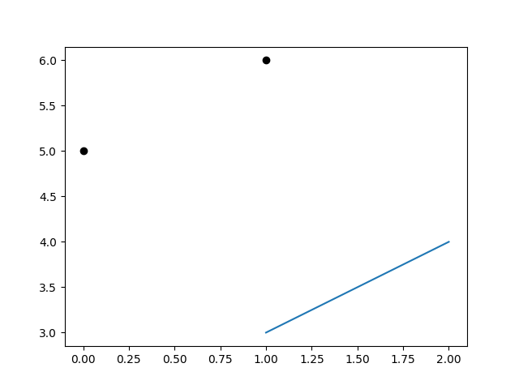
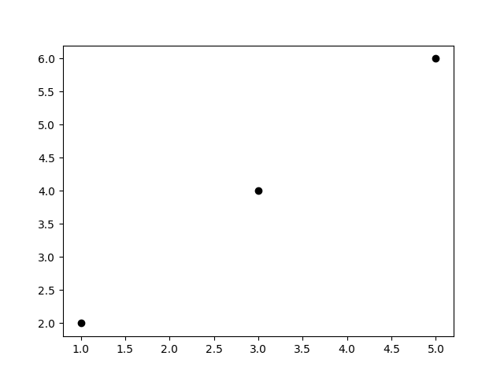

This is hands down my most useful python one liner, and I am embarrassed to say I have frequented the same Stack Overflow entry too many times that I should have remembered it by now.

It concerns converting a list of tuples to two lists. This is very common in my data analysis methodology, as I typically append tuples for X and Y data values mainly for plotting purposes. The reason for using tuples (instead of two lists) is to allow easy sorting and filtering of values after appended to a list. However in some cases I then need to convert it back to two separate lists (matplotlib). For these times Google knows I have forgotten this and immediately gives me the post just by typing 'python list of tup' into the search.

[Here](https://stackoverflow.com/questions/8081545/how-to-convert-list-of-tuples-to-multiple-lists) is the Stack Overflow link, and here is the beautiful one liner.

```python
X, Y = map(list, zip(*list_of_tuples))
```

For example:
```python
lot = [(1, 2), (3, 4), (5, 6)]
X, Y = map(list, zip(*lot))
print(X) # [1, 3, 5]
print(Y) # [2, 4, 6]
```

So now instead of doing the naive plot with:
```python
import matplotlib.pyplot as plt
lot = [(1, 2), (3, 4), (5, 6)]
plt.plot(*lot, 'ko') # does not do what you think it does
plt.show()
```


We actually want:
```python
import matplotlib.pyplot as plt
lot = [(1, 2), (3, 4), (5, 6)]
plt.plot(*map(list, zip(*lot)), 'ko') # does do what you want
plt.show()
```


I hope that by writting this post it will forever ingrain it into my memory.
