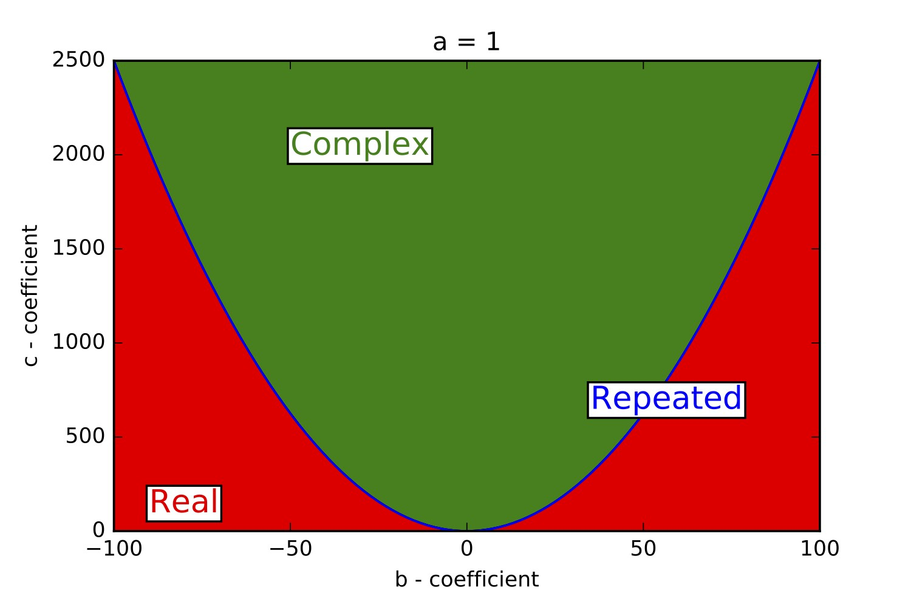

The first mathematics related post, let's keep it simple. Here we are going back to GCSE days.

During my academic life I've dabbled in various teaching roles, mainly during my PhD I would help out undergraduate physics and maths students with their set assignments. Obviously not giving them the answers straight away, but helping them understand the problem. Most of the problems involved were a bit trickier than simple algebra, however no matter how able the student was, the same question always came up when it reduced to a simple quadratic equation - <b>"What's the quadratic formula again?"</b>. Well before I could explain how to derive it, they simple googled the formula, and lo and behold they were awoken from their brief lapse of school classroom panic. This post aims to put that to bed, so that no student will ever need to remember it, and they can then derive it themselves (no internet connection required).

Let's first start with the quadratic equation
$$
ax^{2} + bx + c = 0,
$$
where $a, b, c$ are the coefficients and $x$ is the unknown we wish to solve.

To solve this, we need it in the form of:
$$
(\alpha x + \beta)^{2} - \gamma = 0,
$$
otherwise known as completing the square, such that then we can solve for $x$ as
$$
x = \frac{-\beta \pm \sqrt{\gamma}}{\alpha}.
$$

Expanding the second form we have
$$
\alpha^{2}x^{2} + 2\alpha\beta x + \beta^{2} - \gamma = 0,
$$
and equating coefficients with the first form we have
$$
a = \alpha^{2},
$$
$$
b = 2\alpha\beta,
$$
$$
c= \beta^{2} - \gamma,
$$
or in terms of the unknowns,
$$
\alpha = \pm \sqrt{a},
$$
$$
\beta = \frac{b}{2\sqrt{a}},
$$
$$
\gamma = \frac{b^{2}}{4a} - c.
$$

Simply putting it all back in the solution for $x$ we have our beloved formula
$$
x = \frac{-b \pm \sqrt{b^{2} - 4ac}}{2a}.
$$

Now, let's expand on this. We have a quadratic function, with 3 coefficients, $a, b $ and $ c $, however we have the constraint that it is equal to 0 (since we want the roots of this function). Thus, we can remove 1 coefficient. Let's remove $ a $ for convenience (setting it equal to 1), which can be done by the transformations:
$$
b \rightarrow b/a,
$$
$$
c \rightarrow c/a.
$$

Setting a = 1, we have
$$
x^{2} + bx + c = 0,
$$
and then our beloved formula is slightly simpler (remember that this applies when a = 1 only)
$$
x = \frac{-b \pm \sqrt{b^{2} - 4c}}{2}
$$

The first thing to notice is that we can have a problem with the square root if $b^{2} - 4c \lt 0 $. This of course would lead to 2 complex roots, since $ \sqrt{-1} = i $, where $ i $ indicates an imaginary unit.
We then have 3 possible regimes of roots: 2 real roots, 2 complex roots or 2 degenerate roots (the same root twice), see the below image.

