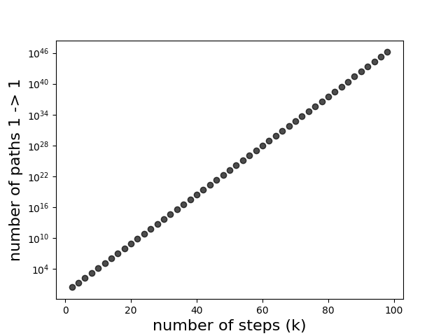
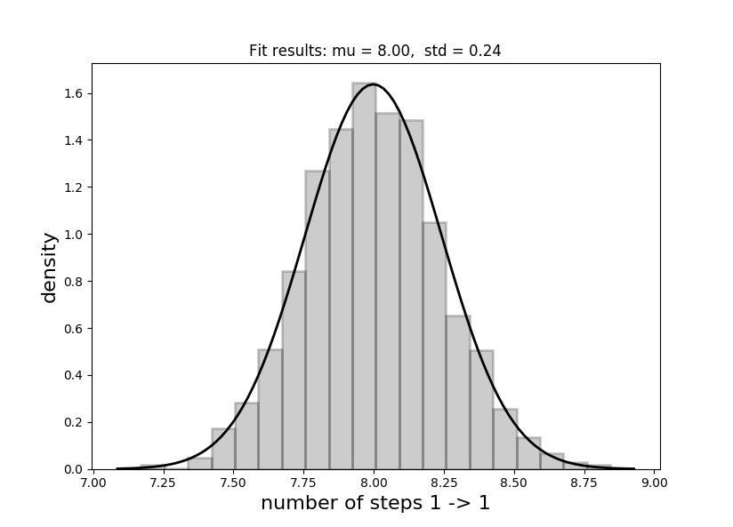
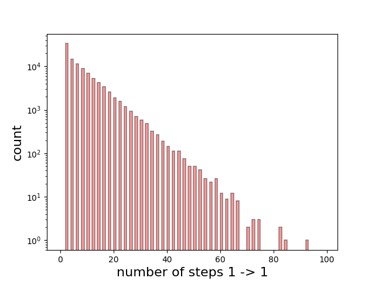

Another interesting question I was was once asked in an interview situation, and one that has always stuck with me (it was about 8 years ago), was about a cube. The question was simple: <b><i>"Given I'm at one corner of the cube and move 1 step each time, what is the average number of steps it would take to end up back at the starting position given I walk in a random manner?"</b></i>. Well, after some thought and solving some simple equations we can arrive at the value of 8. An interesting number no doubt since a cube has eight vertices, but let's see why this turns out to be the case.

First let's draw the cube.


The bottom face has vertices labelled 1, 2, 3 and 4, and the top face has vertices labelled 5, 6, 7 and 8.

Now there are a few ways to solve this, but I will start with the way I did it in the interview first:

<h2>Method 1</h2>

Since it doesn't matter which vertex we start on, due to symmetry, we say that we start on vertex 1. Let us then define the number of steps to get to position 1 from position $i$ as $n_{i}$. Now we clearly have the trivial solution of $n_{1} = 0$, but that is of no use to us given that we have take one step away initially. Therefore the minimum must be 2 steps. It is clear we must have something of the form for the first vertex:
$$
n_{1} = 1 + \frac{1}{3} \big( n_{2} + n_{4} + n_{6} )
$$

Since vertices 2, 4 and 6 are the only positions that reside 1 step away from vertex one, we must take one step from these nodes to reach the initial vertex, hence the first term of 1. Due to symmetry, each vertex then has equal weighting, and a factor of 1/3 applied is applied to the sum of the number of steps from vertex 2, 4 and 6.

We can follow this logic for the remaining 7 vertices, yielding 8 coupled equations, as below.
For the first vertex, we have as stated before
$$
n_{1} = 1 + \frac{1}{3} \big( n_{2} + n_{4} + n_{6} ).
$$

The second vertex then contains the number of steps from vertices 1, 3 and 7
$$
n_{2} = 1 + \frac{1}{3} \big( n_{1} + n_{3} + n_{7} ).
$$
The third vertex then contains the number of steps from vertices 2, 4 and 8
$$
n_{3} = 1 + \frac{1}{3} \big( n_{2} + n_{4} + n_{8} ).
$$
The forth vertex then contains the number of steps from vertices 1, 3 and 5
$$
n_{4} = 1 + \frac{1}{3} \big( n_{1} + n_{3} + n_{5} ).
$$
The fifth vertex then contains the number of steps from vertices 4, 6 and 8
$$
n_{5} = 1 + \frac{1}{3} \big( n_{4} + n_{6} + n_{8} ).
$$
The sixth vertex then contains the number of steps from vertices 1, 5 and 7
$$
n_{6} = 1 + \frac{1}{3} \big( n_{1} + n_{5} + n_{7} ).
$$
The seventh vertex then contains the number of steps from vertices 2, 6 and 8
$$
n_{7} = 1 + \frac{1}{3} \big( n_{2} + n_{6} + n_{8} ).
$$
Finally, the eighth vertex  contains the number of steps from vertices 3, 5 and 7
$$
n_{8} = 1 + \frac{1}{3} \big( n_{3} + n_{5} + n_{7} ).
$$
Now since we have 8 equations and 8 unknown quantities, we can solve the system of equations.

This can be represented in the form $\textbf{n} = \textbf{1} + \frac{1}{3}A\textbf{n}$.
$$
\left(\begin{array}{c}n_{1}\\n_{2}\\n_{3}\\n_{4}\\n_{5}\\n_{6}\\n_{7}\\n_{8}\\\end{array}\right) = 
\textbf{1}_{8} +
\frac{1}{3} \left(\begin{array}{cccccccc}
0 & 1 & 0 & 1 & 0 & 1 & 0 & 0 \\
1 & 0 & 1 & 0 & 0 & 0 & 1 & 0 \\
0 & 1 & 0 & 1 & 0 & 0 & 0 & 1 \\
1 & 0 & 1 & 0 & 1 & 0 & 0 & 0 \\
0 & 0 & 0 & 1 & 0 & 1 & 0 & 1 \\
1 & 0 & 0 & 0 & 1 & 0 & 1 & 0 \\
0 & 1 & 0 & 0 & 0 & 1 & 0 & 1 \\
0 & 0 & 1 & 0 & 1 & 0 & 1 & 0
\end{array}\right)
\left(\begin{array}{c}n_{1}\\n_{2}\\n_{3}\\n_{4}\\n_{5}\\n_{6}\\n_{7}\\n_{8}\\\end{array}\right)
$$

Notice that the matrix $A$ here also represents the adjacency matrix for the graph of the cube, with each edge having weight of 1. We will use this in a different method later to solve this problem in a different way.

Whilst the matrix $A$ has an inverse, in order to solve this equation we need to invert the matrix $\frac{1}{3}A - \textbf{I}$, which has no inverse. This indicates a problem with our setup, and indeed it is because we need to remove the trivial solution of $n_{1} = 0$ by eliminating the first row and column (removing $n_{1}$ from the system of equations) to reduce our problem to 7 equations. Note that symmetry arguments can reduce this in other ways (see method 2).

We then have the reduced set of equations as below, with $A_{reduced}$ now representing the reduced 7 $\times$ 7 matrix.
$$
\left(\begin{array}{c}n_{2}\\n_{3}\\n_{4}\\n_{5}\\n_{6}\\n_{7}\\n_{8}\\\end{array}\right) = 
\textbf{1}_{7} +
\frac{1}{3} \left(\begin{array}{ccccccc}
0 & 1 & 0 & 0 & 0 & 1 & 0 \\
1 & 0 & 1 & 0 & 0 & 0 & 1 \\
0 & 1 & 0 & 1 & 0 & 0 & 0 \\
0 & 0 & 1 & 0 & 1 & 0 & 1 \\
0 & 0 & 0 & 1 & 0 & 1 & 0 \\
1 & 0 & 0 & 0 & 1 & 0 & 1 \\
0 & 1 & 0 & 1 & 0 & 1 & 0
\end{array}\right)
\left(\begin{array}{c}n_{2}\\n_{3}\\n_{4}\\n_{5}\\n_{6}\\n_{7}\\n_{8}\\\end{array}\right)
$$

The inverse of $\frac{1}{3}A_{reduced} - \textbf{I}$ is then denoted as $B$:
$$
B = \frac{1}{3} \left(\begin{array}{ccccccc}
-1 & 1/3 & 0 & 0 & 0 & 1/3 & 0 \\
1/3 & -1 & 1/3 & 0 & 0 & 0 & 1/3 \\
0 & 1/3 & -1 & 1/3 & 0 & 0 & 0 \\
0 & 0 & 1/3 & -1 & 1/3 & 0 & 1/3 \\
0 & 0 & 0 & 1/3 & -1 & 1/3 & 0 \\
1/3 & 0 & 0 & 0 & 1/3 & -1 & 1/3 \\
0 & 1/3 & 0 & 1/3 & 0 & 1/3 & -1
\end{array}\right)
$$

And our solution vector $\textbf{n} = -B^{-1}\textbf{1}_{7}$ (excluding the first vertex), which is gives us
$$
\left(\begin{array}{c}n_{2}\\n_{3}\\n_{4}\\n_{5}\\n_{6}\\n_{7}\\n_{8}\\\end{array}\right) =  
\left(\begin{array}{c}7\\9\\7\\9\\7\\9\\10\\\end{array}\right) 
$$
Which somewhat makes sense, since we know that due to symmetry vertices 2, 4, and 6 must be the same, similarly with 3, 5, and 7. Additionally, with the exception of vertex 8, these positions all have an odd number of steps to get from 1 to their position, which is an interesting result when you consider that 3, 5, and 7 can only be reached in an even number of steps. Of course this does not give us the number from vertex 1. But since we now know all the others, we can substitue $n_{2}$, $n_{4}$, and $n_{6}$ into equation one and therefore get $n_{1} = 1 + \frac{1}{3}(7 + 7 + 7) = 8$, as I promised you at the beginning of this post. 

<h2>Method 2</h2>

Method 2 is actually based on method 1 but we just use symmetry arguments to reduce the matrix even more since $n_{2} = n_{4} = n_{6}$ and $n_{3} = n_{5} = n_{7}$. Thus, the equation is

$$
\left(\begin{array}{c}n_{1}\\n_{2}\\n_{3}\\n_{8}\\\end{array}\right) =
\textbf{1}_{4} +
\left(\begin{array}{cccc}
0 & 1 & 0 & 0 \\
1/3 & 0 & 2/3 & 0 \\
0 & 2/3 & 0 & 1/3 \\
0 & 0 & 1 & 0
\end{array}\right)
\left(\begin{array}{c}n_{1}\\n_{2}\\n_{3}\\n_{8}\\\end{array}\right)
$$

Again removing the trivial solution and therefore $n_{1}$ from the system of equations we follow the previous procedure and arrive at exactly the same result. OK, not a completely different method.

<h2>Method 3</h2>

This is a completely different solution. We now use graph theory to understand how we arrive at 8 steps. 

As stated previously, the matrix $A$ actually represents the adjoint matrix of the graph for a cube (given equal weighted edges - which is the case here). The product $A^{k}\bm{\hat{\mathbf{n}}}$ represents the number of paths from a given vertex to any other vertex. Here $\bm{\hat{\mathbf{n}}}$ represents a unit vector, for the starting node. This is easy to see if examine k=1,2,3,4 and 5.

Staring from vetex 1 again, for k=1 we have
$$
\left(\begin{array}{c}0\\1\\0\\1\\0\\1\\0\\0\\\end{array}\right) = 
\left(\begin{array}{cccccccc}
0 & 1 & 0 & 1 & 0 & 1 & 0 & 0 \\
1 & 0 & 1 & 0 & 0 & 0 & 1 & 0 \\
0 & 1 & 0 & 1 & 0 & 0 & 0 & 1 \\
1 & 0 & 1 & 0 & 1 & 0 & 0 & 0 \\
0 & 0 & 0 & 1 & 0 & 1 & 0 & 1 \\
1 & 0 & 0 & 0 & 1 & 0 & 1 & 0 \\
0 & 1 & 0 & 0 & 0 & 1 & 0 & 1 \\
0 & 0 & 1 & 0 & 1 & 0 & 1 & 0
\end{array}\right)
\left(\begin{array}{c}1\\0\\0\\0\\0\\0\\0\\0\\\end{array}\right),
$$
which is obvious - there is one path from 1 $\rightarrow$ 2, one path from 1 $\rightarrow$ 4, and one path from 1 $\rightarrow$ 6. That is all that we can do.

Similarly for k=2
$$
\left(\begin{array}{c}3\\0\\2\\0\\2\\0\\2\\0\\\end{array}\right) = 
\left(\begin{array}{cccccccc}
0 & 1 & 0 & 1 & 0 & 1 & 0 & 0 \\
1 & 0 & 1 & 0 & 0 & 0 & 1 & 0 \\
0 & 1 & 0 & 1 & 0 & 0 & 0 & 1 \\
1 & 0 & 1 & 0 & 1 & 0 & 0 & 0 \\
0 & 0 & 0 & 1 & 0 & 1 & 0 & 1 \\
1 & 0 & 0 & 0 & 1 & 0 & 1 & 0 \\
0 & 1 & 0 & 0 & 0 & 1 & 0 & 1 \\
0 & 0 & 1 & 0 & 1 & 0 & 1 & 0
\end{array}\right)^{2}
\left(\begin{array}{c}1\\0\\0\\0\\0\\0\\0\\0\\\end{array}\right).
$$
There are now three unique paths from 1 $\rightarrow$ 1, two unique paths from 1 $\rightarrow$ 3, two unique paths from 1 $\rightarrow$ 5, and indeed two unique paths from 1 $\rightarrow$ 7. I encourage you to confirm this by hand (it is correct).

It gets a bit more tricky to do by hand for $k > 2$ but if you trust me k=3,4, and 5 are
$$
n_{k=3} = \left(\begin{array}{c}0\\7\\0\\7\\0\\7\\0\\6\\\end{array}\right),
n_{k=4} = \left(\begin{array}{c}21\\0\\20\\0\\20\\0\\20\\0\\\end{array}\right),
n_{k=5} = \left(\begin{array}{c}0\\61\\0\\61\\0\\61\\0\\60\\\end{array}\right).
$$

Since only even values of $k$ lead to paths back to vertex 1 we consider the sequence of $k \in 2,4,6,....$ which goes as:
$$
3, 21, 183, 1641, 14763, 132861, 1195743, 10761681, 96855123, 871696101, 7845264903, 70607384121, ...
$$
exponentially increasing with each $k$. It is not obvious how this sequence is defined, we can examine the relationship below (note the log y scale). 



It is worth noting that the probability of going from vertex 1 back to 1 in taking $k$ steps, labelled as $p^{k}_{1 \rightarrow 1}$, quickly converges to 0.25 as $k \rightarrow \infty$ (proof needed here). Thus is we know the probability of taking $k$ steps we can then determine the average number of steps from 1 back to 1 i.e. $n_{1}$.
$$
n_{1} = {\sum^{\infty}_{k=1}{2k p^{2k}_{1 \rightarrow 1} \prod^{2(k-1)}_{j=1}(1 - p^{2j}_{1 \rightarrow 1}) }}
$$


<h2>Monte Carlo confirmation</h2>
Since I am an experimentalist I like to confirm with experiment, and in this case we will do a simple Monte Carlo approach to confirm that the answer is indeed 8. I am using vanilla Python3 (with some numpy ans scipy to help) to make a simple script to compute this.

First we need to define our graph via a series of nodes/vertices and edges.
```python
# make a graph of a cube with 8 vertices we could indeed use a library such as networkx
# but we keep it simple and vanilla for educational purposes
CUBEGRAPH = {
    'nodes': [
        1, 2, 3, 4, 5, 6, 7, 8
    ],
    'edges': [
        (1, 2),
        (1, 4),
        (1, 6),
        (2, 3),
        (2, 7),
        (3, 4),
        (3, 8),
        (4, 5),
        (5, 6),
        (5, 8),
        (6, 7),
        (7, 8)
    ]
}
```

Since the weights are all equal and 1 we neglect any notion of weighted edges and it is an undirected graph.

A first function that is useful is to determine the adjacent vertices given an input vertex, this is simple to implement.
```python
def getadjacent(graph, vertex):
    """
        vertex is the node indexnumber i.e 1, 2, 3, ... or 8
        and returns all adjacent nodes

        For example:
            getadjacent(1) -> [2, 4, 6]
            getadjacent(2) -> [1, 3, 7]
            getadjacent(3) -> [2, 4, 8]
            ....
    """
    nodes = []
    for n1, n2 in graph['edges']:
        if n1 == vertex:
            nodes.append(n2)
        if n2 == vertex:
            nodes.append(n1)
    return sorted(nodes)
```

Now to introduce randomness, which is the cornerstone of the Monte Carlo method. We do this by splitting our adjacent nodes equally and allocating a range to active that path by randomly sampling from a uniform distribution in (0,1]. For example if we are at node 1, we can either go to node 2, node 4, or node 6 each with equally probability. Thus, if we roll (0,1/3] we go to node 2 via the path 1 $\rightarrow$ 2, if we roll (1/3,2/3] we go to node 4 via the path 1 $\rightarrow$ 4, and for anything between (2/3,1] we go to node 6 via path 1 $\rightarrow$ 6. The function below does this for us, given any staring node and any number of steps (default 1).

```python

def randomstep(graph, start, steps=1):
    """
        Take a random step(s) from a starting node.
        Return the node ending on.

        Since all edges are equal all weights are 1

        This function assumes weight =1, to extend
        we would need to define weights in edge data
    """
    if start < min(graph['nodes']) or start > max(graph['nodes']):
        raise RuntimeError("Invalid node number: {}".format(start))

    if steps == 0:
        return start

    # get all adjacent nodes
    anodes = getadjacent(graph, start)

    # generate a random number drawn from a uniform distribution
    rmin, rmax = 0, 1
    prob = np.random.uniform(rmin, rmax, 1)[0]

    # equal weights
    # this remains unchanged every call, should be moved
    # out but if weights change then code is needed here
    weights = [(rmax-rmin)/len(anodes)]*len(anodes)
    r = rmin
    for w, n in zip(weights, anodes):
        r += w
        if r > prob:
            # use recursion for this problem
            return randomstep(graph, n, steps=steps-1)
    
    return None
```


The function to do the 'walk' is then simple, given a start and end point keep randomly moving from node to node until we which our desired end point.
```python
def getnumberofsteps(graph, start, end):
    nextnode = start
    count = 0
    while nextnode != end or (count == 0 and nextnode == end):
        nextnode = randomstep(graph, nextnode, steps=1)
        count += 1
    return count
```

Putting this all together we can do this walk many times (10,000 times) we take the mean of all walks to give us our average number of steps.
```python
def estimateaveragewalk(graph, start, end, niter=1000, op=np.mean):
    steps = []
    for _ in range(niter):
        steps.append(getnumberofsteps(graph, start, end))
    return op(steps)
```

Then to estimate $n_{1}$ (to go from node one back to node 1) is simply as below.
```python
averagesteps = estimateaveragewalk(CUBEGRAPH, 1, 1, niter=10000)
# this should be close to 8 if you set niter high enough
print("1 -> {} = {:.3f}".format(1, averagesteps))
```

Running this once for 10,000 iterations I got 7.905, so not too far off. In order to actually see whether this is statistically correct, we need to run this many times and examine the distribution. 

After doing this I get a very nice fitting Gaussian with a value of 8.00 $\pm$ 0.24. Exactly bang on!


Here are the results for paths containing up to 100 steps for 10,000 iterations to show the relative probabilities of each path.

