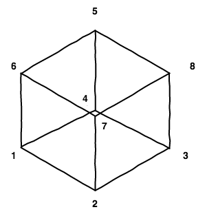

Another interesting question I was asked in a job interview, was about a cube. The question was simple: "Given I'm at one corner of the cube and move 1 step each time, what is the expected number of steps it would take for a random walk to end up back on the starting position?". Well, after some thought and solving some simple equations we can arrive at the value of 8. An interesting number no doubt since a cube has eight vertices, but let's see why this turns out to be the case.

First let's draw the cube.

The bottom face has vertices labelled 1, 2, 3 and 4, and the top face has vertices labelled 5, 6, 7 and 8.

Let us define the number of steps to get to position 1 from position $i$ as $n_{i}$. Now we clearly have the trivial solution of $n_{1} = 0$, but that is of no use to us given that we have take one step away initially. It is then clear we must have something of the form for the first vertex:
$$
n_{1} = 1 + \frac{1}{3} \big( n_{2} + n_{4} + n_{6} )
$$

Since vertices 2, 4 and 6 are the only positions that reside 1 step away from vertex one, we must take one step from these nodes to reach the initial vertex, hence the first term of 1. Due to symmetry, each vertex then has equal weighting, and a factor of 1/3 applied is applied to the sum of the number of steps from vertex 2, 4 and 6.

We can follow this logic for the remaining 7 vertices, yielding 8 coupled equations, as below.
For the first vertex, we have as stated before
$$
n_{1} = 1 + \frac{1}{3} \big( n_{2} + n_{4} + n_{6} ).
$$

The second vertex then contains the number of steps from vertices 1, 3 and 7
$$
n_{2} = 1 + \frac{1}{3} \big( n_{1} + n_{3} + n_{7} ).
$$
The third vertex then contains the number of steps from vertices 2, 4 and 8
$$
n_{3} = 1 + \frac{1}{3} \big( n_{2} + n_{4} + n_{8} ).
$$
The forth vertex then contains the number of steps from vertices 1, 3 and 5
$$
n_{4} = 1 + \frac{1}{3} \big( n_{1} + n_{3} + n_{5} ).
$$
The fifth vertex then contains the number of steps from vertices 4, 6 and 8
$$
n_{5} = 1 + \frac{1}{3} \big( n_{4} + n_{6} + n_{8} ).
$$
The sixth vertex then contains the number of steps from vertices 1, 5 and 7
$$
n_{6} = 1 + \frac{1}{3} \big( n_{1} + n_{5} + n_{7} ).
$$
The seventh vertex then contains the number of steps from vertices 2, 6 and 8
$$
n_{7} = 1 + \frac{1}{3} \big( n_{2} + n_{6} + n_{8} ).
$$
Finally, the eighth vertex  contains the number of steps from vertices 3, 5 and 7
$$
n_{8} = 1 + \frac{1}{3} \big( n_{3} + n_{5} + n_{7} ).
$$
Now since we have 8 equations and 8 unknown quantities, we can solve the system of equations.

